# Thonny中Mpy包管理器插件的安装和使用

> 源文件：`dev/Thonny中Mpy包管理器插件的安装和使用.pdf` · 共 19 页

## 第 1 页

Thonny中Mpy包管理器插件的安装和使用​

零、前言​

在 MicroPython 的开发过程中，第三方驱动库是实现传感器交互、通信协议、界面控制等功能的核心

依赖。为了给开发者提供一个集中、规范的包分享平台，我们团队维护了uPyPi 仓库—— 目前这里已

经收录了 173 个各类 MicroPython 包，覆盖传感器驱动、通信模块、人机交互等多个场景，解决了大

家 “找包难、找包乱” 的问题。​

不过目前，大多数开发者使用 uPyPi 包的方式，还是需要从仓库页面复制mpremote mip

install 命令，再手动粘贴到终端执行安装。这个过程不仅要处理串口连接、命令格式，还得自己排

查依赖问题，对新手非常不友好，也拉低了开发效率。​

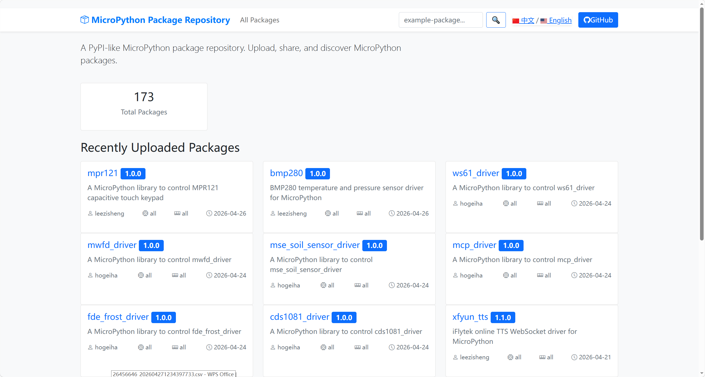

> **图片文字识别**：MicroPython Package Repository All Packages example-package... 中文/English QGitHub A PyPl-like MicroPython package repository. Upload, share, and discover MicroPython packages. 173 Total Packages Recently Uploaded Packages mpr121 1.0.0 bmp280 1.0.0 ws61_driver 1.0.0 A MicroPython library to control MPR121 BMP280 temperature and pressure sensor driver A MicroPython library to control ws61_driver capacitive touch keypad for MicroPython 8 hogeiha all m all 2026-04-24 8 leezisheng @all all 2026-04-26 8 leezisheng Oall all 2026-04-26 mwfd_driver 1.0.0 mse_soil_sensor_driver 1.0.0 mcp_driver 1.0.0 A MicroPython library to control mwfd_driver A MicroPython library to control A MicroPython library to control mcp_driver mse_soil_sensor_driver 8 hogeiha oall E all 2026-04-24 8 hogeiha 目all 2026-04-24 8hogeiha all 2026-04-24 fde_frost_driver 1.0.0 cds1081_driver 1.0.0 xfyun_ts 1.1.0 A MicroPython library to control fde_frost_driver A MicroPython library to control cds1081_driver iFlytek online TTS WebSocket driver for MicroPython 8 hogeiha o all E all 2026-04-24 8 hogeiha E all 2026-04-24 8 leezisheng all Ball 2026-04-21 WPS Office

## 第 2 页

为了彻底解决这个痛点，我们开发了thonny-upypi-manager这个 Thonny IDE 插件 —— 它把 uPyPi

仓库的包管理功能直接集成到了 Thonny 里，不用再打开网页复制命令，也不用手动处理依赖，在

IDE 内就能完成从搜索、查看、缓存到一键安装的全流程。​

一、插件介绍​

thonny-upypi-manager 是我们专为 Thonny IDE 打造的第三方插件，核心作用是对接我们团队

维护的uPyPi（MicroPython 风格包仓库），实现 MicroPython 包的全流程可视化管理，适配

Thonny 4.1.7 及以上版本。​

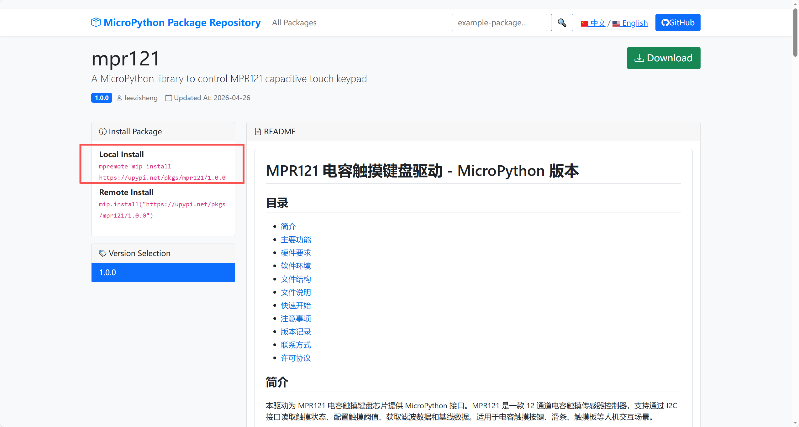

> **图片文字识别**：MicroPythonPackageRepository All Packages example-package... 中文/English QGitHub mpr121 ↓ Download A MicroPython library to control MPR121 capacitive touch keypad 1.0.0 2 leezisheng Updated At: 2026-04-26 ① Install Package README Local Install mpremote mip install MPR121电容触摸键盘驱动-MicroPython版本 https://upypi.net/pkgs/mpr121/1.0.0 Remote Install 目录 mip.install("https://upypi.net/pkgs /mpr121/1.0.0") ·简介 ·主要功能 Version Selection ·硬件要求 ·软件环境 1.0.0 ·文件结构 ·文件说明 ·快速开始 ·注意事项 ·版本记录 ·联系方式 ·许可协议 简介 本驱动为MPR121电容触摸键盘芯片提供MicroPython接口。MPR121是一款12通道电容触摸传感器控制器，支持通过I2C 接口读取触摸状态、配置触摸阈值、获取滤波数据和基线数据。适用于电容触摸按键、滑条、触摸板等人机交互场景。

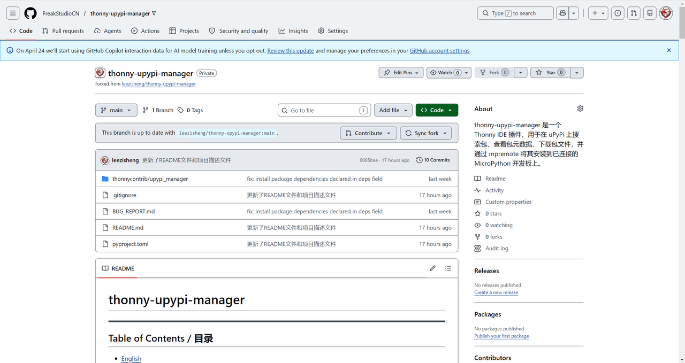

> **图片文字识别**：FreakStudioCN/ thonny-upypi-manager Q Typeto search 田 <>Code Pullrequests Agents Actions 田Projects SecurityandqualityInsights Settings On April 24 we'llstart using GitHub Copilot interaction data for Al model training unless you opt out. Review this update and manage your preferences in your GitHub account settings. thonny-upypi-manager Private sud P Watch Fork 、 Star forked from lezisheng/thonny-upypi-manager ° main 1Branch 0 Tags Q Go to fle Add file <>Code About —abeuew-iddn-Auuoy This branch is up to date with leezisheng/thonny-upypi-manager:main . Contribute G Sync fork Thonny IDE插件，用于在uPyPi上搜 索包、查看包元数据、下载包文件，并 通过mpremote将其安装到已连接的 leezisheng更新了README文件和项目描述文件 0085bae·17 hours ago 10 Commits MicroPython开发板上。 thonnycontrib/upypi_manager fix: installpackage dependencies declared in deps field last week Readme gitignore 17 hours ago Activity 更新了README文件和项目描述文件 Custom properties BUG_REPORT.md fix: install package dependencies declared in deps field last week ☆0stars README.md 更新了README文件和项目描述文件 17 hours ago 0 watching Oforks pyproject.toml 更新了README文件和项目描述文件 17 hours ago Audit log README 三 Releases No releases published thonny-upypi-manager Create a new release Packages No packages published Table of Contents/目录 Publish your first package ·English Contributors

## 第 3 页

简单来说，它就是 uPyPi 仓库的 “Thonny 客户端”，让你不用再切换网页、复制终端命令，在 IDE

里就能搞定所有包管理操作。​

Github 源代码地址：https://github.com/FreakStudioCN/thonny-upypi-manager​

它的功能覆盖了包管理的全流程，能解决开发中的多个痛点：​

•
✅ 包搜索与元数据查看：直接在 Thonny 内搜索 uPyPi 上的所有包，还能查看每个包的

package.json 信息（版本、作者、依赖项），不用再切换到网页端查询。​

•
✅ 本地缓存管理：支持多文件包的本地缓存，下载过的包会自动存到本地，重复使用时无需重新

下载。​

•
✅ 一键安装到开发板：通过mpremote 工具，直接把包安装到连接的 MicroPython 开发板

的/lib 目录，省去手动复制文件的步骤。​

•
✅ 自动依赖处理：会读取包的package.json 中deps 字段，在安装主包前自动安装所有依赖

项，不用再手动挨个找依赖。​

•
✅ 错误友好提示：遇到网络不通、mpremote 未配置、开发板未连接等问题时，会给出清晰的提

示，帮你快速定位和解决问题。​

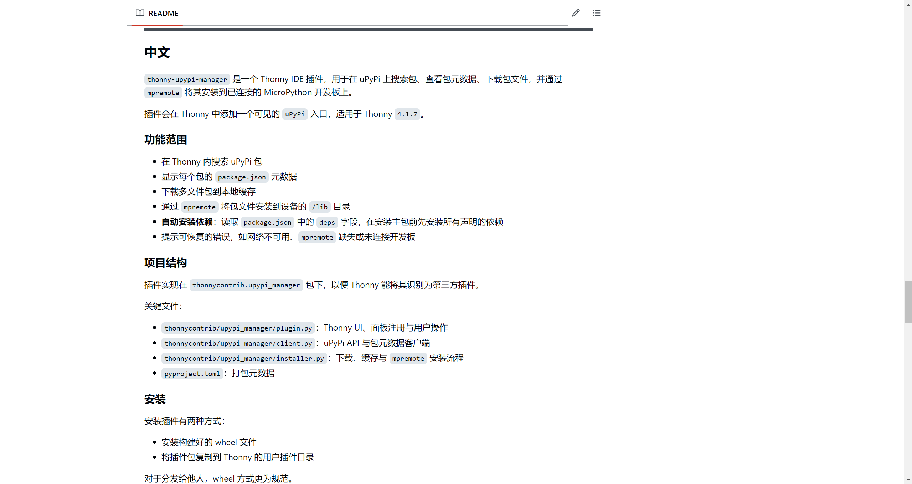

> **图片文字识别**：README 三 中文 thonny-upypi-manager是一个Thonny IDE 插件，用于在uPyPi上搜索包、查看包元数据、下载包文件，并通过 mpremote将其安装到已连接的MicroPython开发板上。 插件会在Thonny中添加一个可见的uPyPi入口，适用于Thonny 4.1.7。 功能范围 ·在 Thonny 内搜索 uPyPi包 ·显示每个包的package.json元数据 ·下载多文件包到本地缓存 ·通过mpremote 将包文件安装到设备的/lib目录 ·自动安装依赖：读取package.json中的deps字段，在安装主包前先安装所有声明的依赖 ·提示可恢复的错误，如网络不可用、mpremote缺失或未连接开发板 项目结构 插件实现在 thonnycontrib.upypi_manager 包下，以便 Thonny 能将其识别为第三方插件。 关键文件： thonnycontrib/upypi_manager/plugin.py：Thonny Ul、面板注册与用户操作 thonnycontrib/upypi_manager/client.py：uPyPiAPI与包元数据客户端 thonnycontrib/upypi_manager/installer.py：下载、缓存与mpremote 安装流程 pyproject.toml：打包元数据 安装 安装插件有两种方式： ·安装构建好的 wheel文件 ·将插件包复制到Thonny的用户插件目录 对于分发给他人，wheel方式更为规范。

## 第 4 页

PyPI 地址：https://pypi.org/project/thonny-upypi-manager/​

这个插件的源码由 Freak 嵌入式工作室维护，托管在 GitHub 仓库中，目前是 Thonny 端最便捷的

MicroPython 包管理工具之一，后续也会持续更新维护，优化功能和兼容性。​

二、插件安装​

在安装插件之前，我们首先需要安装Python的基本环境，这里我们推荐使用miniconda 环境管理

器：​

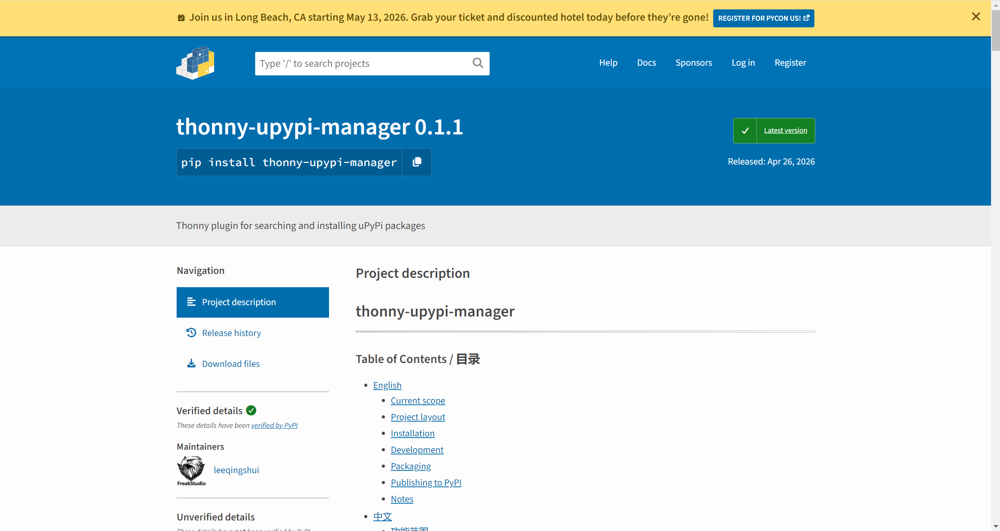

> **图片文字识别**：Join us in Long Beach, CA starting May 13, 2026. Grab your ticket and discounted hotel today before they're gone! REGISTERFORPYCONUS!C? Type '/' to search projects Help Docs Sponsors Log in Register thonny-upypi-manager 0.1.1 Latest version pip install thonny-upypi-manager Released:Apr26,2026 Thonny plugin for searching and installing uPyPi packages Navigation Project description 三 Project description thonny-upypi-manager Release history Download files Tableof Contents/目录 ·English ·Current scope Verified details ·Project layout ThesedetailshavebeenyerifiedbyPyPl Installation Maintainers Development leeqingshui ·Packaging FreakStudio ·Publishing to PyPl ·Notes Unverified details 中文

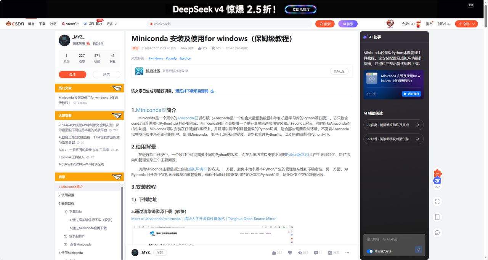

> **图片文字识别**：DeepSeekv4惊爆2.5折！ 立即抢额度 CSDn博客下载社区 G AtomGit GPU筋 更多 miniconda Q搜索 AI搜索 会员中心 消息 创作中心 十创作 _MYZ_ Miniconda安装及使用forwindows（保姆级教程） ←AI助手 博客等级号 码龄6年 原的 于 2024-07-07 15:29:46发布 10w+阅读 227食565 -CC 4.0 BY-SA版权 227 571 41 Miniconda轻量级Python环境管理工 1 原创 点费 收量 粉益 文章标签： #windows #conda #python 具救程，含安装配置及虚拟环境操作 指南，并提供完整示例代码包下载。 脑启社区文育已被社区收录 关注 加入社区 私信 Miniconda安装及便用for w indows（保姆级教程） 热门文章 该文章已生成可运行项目，预览并下载项目源码 AI生成 远行项目 Miniconda 安装及便用for windows（保姆 级教程）○216189 1.Miniconda回简介 大家在看 AI辅助阅读 Miniconda是一个更小的Anaconda发行版（Anaconda是一个包含大量预装数据科学和机器学习库的Python发行版），它只包含 2026年AI大模型API中转服务全网实测：探 conda包管理器和Python以及其必要的库。Miniconda的目的是提供一个更轻量级的选项来安装和运行conda环境，同时保持Anaconda的 AI解读-剖析博文结构及重点 寻最适配不同应用场景的优质平台0281 从故障工单到OEE监控，TPM实战体系折解 完整发行版中所有组件的用户。使用Miniconda，用户可以轻松地安装、更新和管理Python包，以及创建隔离的Python环境。 与落地参数030 A对话-阅读助手及对话引降 → 2.使用背景 SQLX:一款优秀的异步SQL工具库O45 Keycloak工具接入○72 在进行项目开发中， 一个项目中可能需要不同的Python的版本，而在系统内直接安装不同的Python版本回会产生环境冲突、路径指 向和管理复杂三个主要问题。 MCU+WiFi与CPU+WiFi模块区别 便用Miniconda主要是通过创建虚拟环境回的方式，一方面，避免本地多版本Python产生的管理复杂性和不稳定性。另一方面，为 目录 Python项目开发中实现环境隔离和依赖管理，确保不同项目能够使用特定版本的Python和库，避免版本冲突和依赖问题。 1.Miniconda简介 3.安装教程 2.使用背景 1）下载地址 3.安装教程 1）下载地址 a.通过清华镜像源下载（较快） a.通过清华镜像源下载（较快） Indexof /anaconda/miniconda/|清华大学开源软件镜像站|TsinghuaOpen Source Mirror 口 b.通过Miniconda官网下载 2）安装包操作 输入内容，与AI对话 3）查看Miniconda 4.使用Miniconda MYZ_ 关注 565 18 分享 结合情文对话

## 第 5 页

详细教程可看：https://blog.csdn.net/ming12131342/article/details/140233867​

插件提供了两种安装方式：从 PyPI 在线安装（适合网络环境正常的情况，简单快捷）和从本地文件安

装（适合网络受限的情况，提前下载好安装包），你可以根据自己的情况选择其中一种。​

首先启动 Thonny IDE，点击顶部菜单栏的【工具】，选择【管理插件...】（部分版本翻译为 “管理软

件包”），即可打开插件管理窗口。​

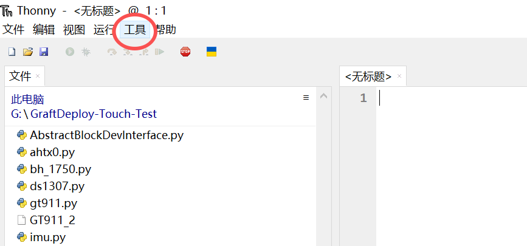

> **图片文字识别**：Thonny－<无标题>@1:1 文件 编辑视图运行 工具 帮助 文件 <无标题> 此电脑 1 G:\ GraftDeploy-Touch-Test AbstractBlockDevlnterface.py ahtx0.py bh 1750.py ds1307.py gt911.py GT911 2 imu.py

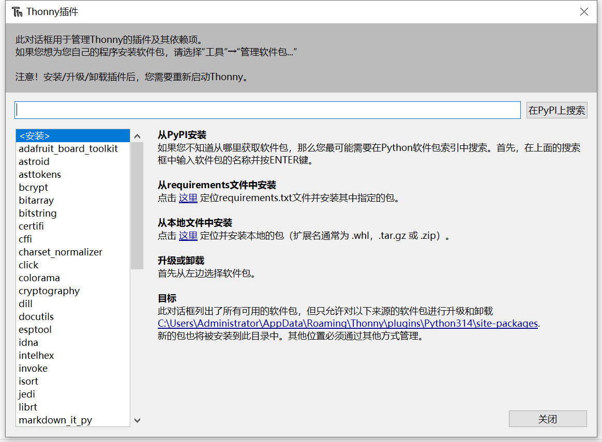

> **图片文字识别**：Thonny插件 × 此对话框用于管理Thonny的插件及其依赖项。 如果您想为您自己的程序安装软件包，请选择"工具"→"管理软件包." 注意！安装/升级/卸载插件后，您需要重新启动Thonny。 在PyPI上搜索 <安装> 从PyPI安装 adafruit_board_toolkit 如果您不知道从哪里获取软件包，那么您最可能需要在Python软件包索引中搜索。首先，在上面的搜索 astroid 框中输入软件包的名称并按ENTER键。 asttokens bcrypt 从requirements文件中安装 bitarray 点击 这里定位requirements.txt文件并安装其中指定的包。 bitstring certifi 从本地文件中安装 cffi 点击这里定位并安装本地的包（扩展名通常为.whl，.tar.gz或.zip）。 charset normalizer click 升级或卸载 colorama 首先从左边选择软件包。 cryptography 目标 dill docutils 此对话框列出了所有可用的软件包，但只允许对以下来源的软件包进行升级和卸载 C:\Users\Administrator\AppData\Roaming\Thonny\pluqins\Python314\site-packaqes. esptool 新的包也将被安装到此目录中。其他位置必须通过其他方式管理。 idna intelhex invoke isort jedi librt markdown_it_py 关闭

## 第 6 页

2.1 从PyPI安装​

这是最推荐的安装方式，全程仅需几步操作，无需手动处理文件：​

在插件管理窗口的搜索框中，输入插件名thonny-upypi-manager ，点击右侧的【在 PyPI 上搜

索】按钮，稍等片刻就能看到搜索结果。​

注意，有时候由于网络问题，会导致搜索不到，隔几分钟以后再次搜索就可以，如果还是不行，本地

安装！​

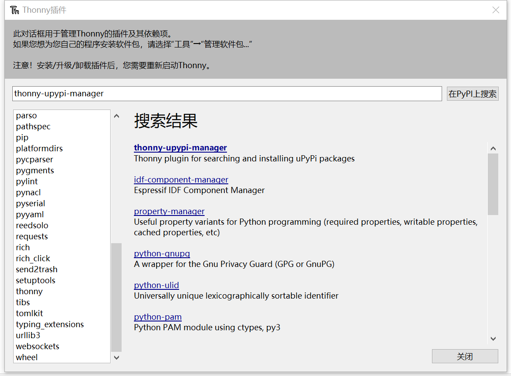

> **图片文字识别**：Thonny插件 此对话框用于管理Thonny的插件及其依赖项。 如果您想为您自己的程序安装软件包，请选择"工具"→"管理软件包." 注意！安装/升级/卸载插件后，您需要重新启动Thonny。 thonny-upypi-manager 在PyPI上搜索 parso 搜索结果 pathspec pip platformdirs thonny-upypi-manager pycparser Thonny plugin for searching and installing uPyPi packages pygments pylint idf-component-manaqer pynacl Espressif IDF Component Manager pyserial pyyaml property-manaqer Useful property variants for Python programming (required properties, writable properties, reedsolo requests cached properties, etc) rich python-qnupq rich_click A wrapper for the Gnu Privacy Guard (GPG or GnuPG) send2trash setuptools python-ulid thonny Universally unique lexicographically sortable identifier tibs tomlkit python-pam typing_extensions Python PAM module using ctypes, py3 urllib3 websockets wheel 关闭

## 第 7 页

在搜索结果列表中找到thonny-upypi-manager ，点击后会显示插件的详细信息（版本、作者、

依赖要求等），此时点击窗口下方的【安装】按钮，即可自动完成下载和安装。​

安装完成后，插件管理窗口的左侧列表会出现thonny_upypi_manager ，此时必须关闭并重新打

开 Thonny，插件才能正常生效。​

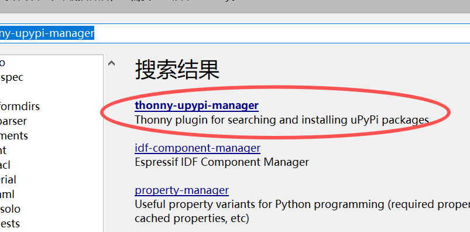

> **图片文字识别**：ny-upypi-manager 搜索结果 spec ormdirs thonny-upypi-manager barser Thonny plugin for searching and installing uPyPi packages ments nt idf-component-manaqer acl Espressif IDF Component Manager rial ml property-manaqer solo Useful property variants for Python programming (required prope ests cached properties, etc)

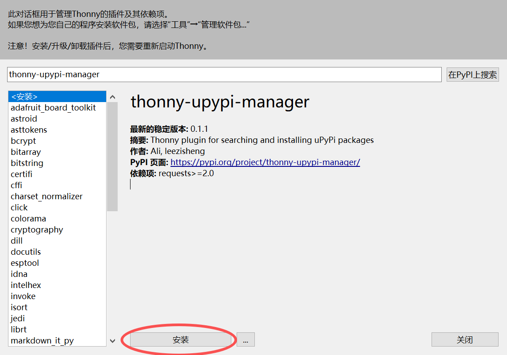

> **图片文字识别**：此对话框用于管理Thonny的插件及其依赖项。 如果您想为您自己的程序安装软件包，请选择"工具"→"管理软件包.." 注意！安装/升级/卸载插件后，您需要重新启动Thonny。 thonny-upypi-manager 在PyPI上搜索 <安装> thonny-upypi-manager adafruit_board_toolkit astroid asttokens 最新的稳定版本:0.1.1 bcrypt 摘要: Thonny plugin for searching and installing uPyPi packages bitarray 作者: Ali, leezisheng bitstring PyPl 页面:https://pypi.org/project/thonny-upypi-manaqer/ certifi 依赖项: requests>=2.0 charset _normalizer click colorama cryptography dill docutils esptool idna intelhex invoke isort jedi librt markdown_it _py 安装 关闭

## 第 8 页

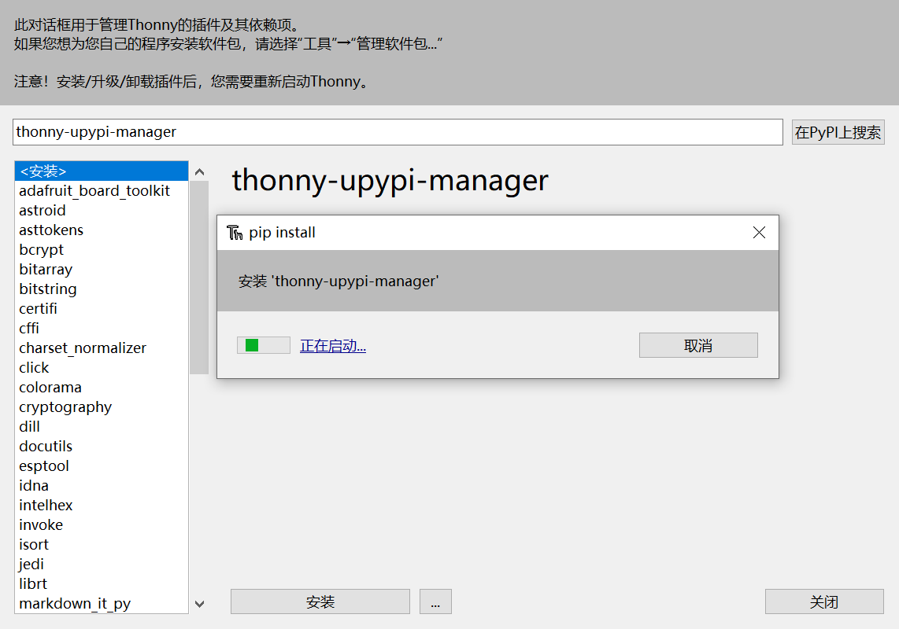

> **图片文字识别**：此对话框用于管理Thonny的插件及其依赖项。 如果您想为您自己的程序安装软件包，请选择"工具"→"管理软件包.." 注意！安装/升级/卸载插件后，您需要重新启动Thonny。 thonny-upypi-manager 在PyPI上搜索 <安装> thonny-upypi-manager adafruit board toolkit astroid asttokens T pip install × bcrypt bitarray bitstring 安装'thonny-upypi-manager' certifi charset _normalizer 正在启动... 取消 click colorama cryptography dill docutils esptool idna intelhex invoke isort jedi librt markdown_it _py 安装 关闭

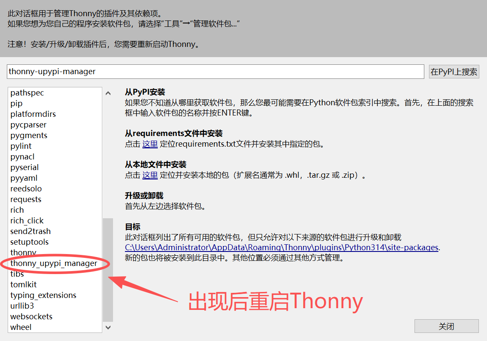

> **图片文字识别**：此对话框用于管理Thonny的插件及其依赖项。 如果您想为您自己的程序安装软件包，请选择"工具"→"管理软件包.." 注意！安装/升级/卸载插件后，您需要重新启动Thonny。 thonny-upypi-manager 在PyPI上搜索 pathspec 从PyPI安装 pip 如果您不知道从哪里获取软件包，那么您最可能需要在Python软件包索引中搜索。首先，在上面的搜索 platformdirs 框中输入软件包的名称并按ENTER键。 pycparser 从requirements文件中安装 pygments pylint 点击 这里定位requirements.txt文件并安装其中指定的包。 pynacl pyserial 从本地文件中安装 pyyaml 点击 这里定位并安装本地的包（扩展名通常为.whl，.tar.gz或.zip）。 reedsolo 升级或卸载 requests rich 首先从左边选择软件包。 rich click 目标 send2trash 此对话框列出了所有可用的软件包，但只允许对以下来源的软件包进行升级和卸载 setuptools C:\Users\Administrator\AppData\Roaming\Thonny\pluqins\Python314\site-packaqes. thonnv 新的包也将被安装到此目录中。其他位置必须通过其他方式管理。 thonny_upypi_manager tibs tomlkit typing_extensions 出现后重启Thonny urllib3 websockets wheel 关闭

## 第 9 页

重启后，你会在 Thonny 的工具栏看到插件的专属图标，说明安装成功。​

2.2 从本地文件中安装​

如果你的电脑网络受限，无法直接从 PyPI 下载，可以选择提前下载安装包，通过本地文件安装：​

首先，到【附件-本地安装包】中下载.whl 文件：​

•
主安装包：thonny_upypi_manager-0.1.1-py3-none-any.whl （稳定版，优先使用）​

•
备用包：thonny_upypi_manager-0.1.1.tar.gz （源码包，用于特殊场景）​

> **图片文字识别**：Thonny－<无标题>@1:1 文件 编辑 视图 运行 工具 帮助 TOP 文件 <无标题> 此电脑 1 G:\GraftDeploy-Touch-Test AbstractBlockDevlnterface.py ahtx0.py bh_1750.py ds1307.py gt911.py GT911.2

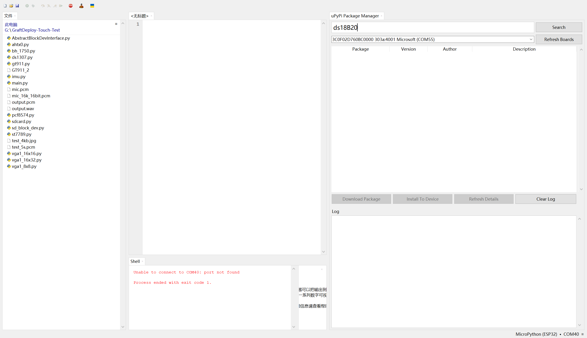

> **图片文字识别**：文件 <无标题> uPyPi Package Manager 此电脑 1 ds18B20 Search G:\GraftDeploy-Touch-Test AbstractBlockDevlnterface.py 3C0F02D760BC0000 303a:4001 Micr0soft (COM55) Refresh Boards ahtx0.py bh_1750.py Package Version Author Description ds1307.py gt911.py GT911_2 imu.py main.py mic.pcm mic_16k_16bit.pcm output.pcm output.wav pcf8574.py sdcard.py sd _block_dev.py st7789.py test _4kbjpg test_5s.pcm vga1_16x16.py vga1_16x32.py vga1_8x8.py Download Package Install To Device Refresh Details Clear Log Log Shell Unable to connect to coM40: port not found Process ended with exit code 1. 器可以把输出到 系列数字可视 日信息请查看帮目 MicroPython (ESP32) · COM40 =

## 第 10 页

打开 Thonny 的【工具】→【管理插件...】，在窗口右侧的选项区中，找到【从本地文件中安装】，点

击对应的链接打开文件选择窗口。​

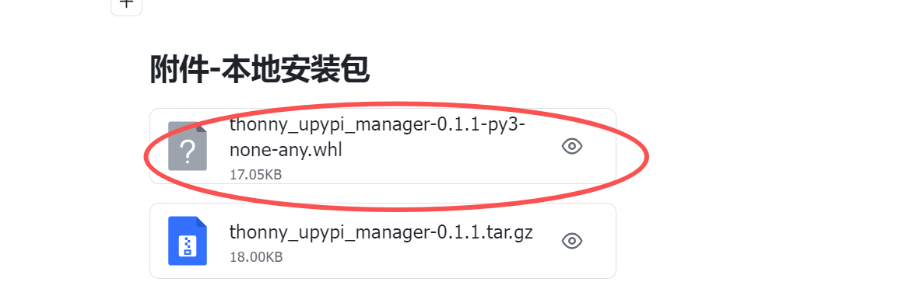

> **图片文字识别**：附件-本地安装包 thonny_upypi_manager-0.1.1-py3- none-any.whl 17.05KB thonny_upypi_manager-0.1.1.tar.gz 18.00KB

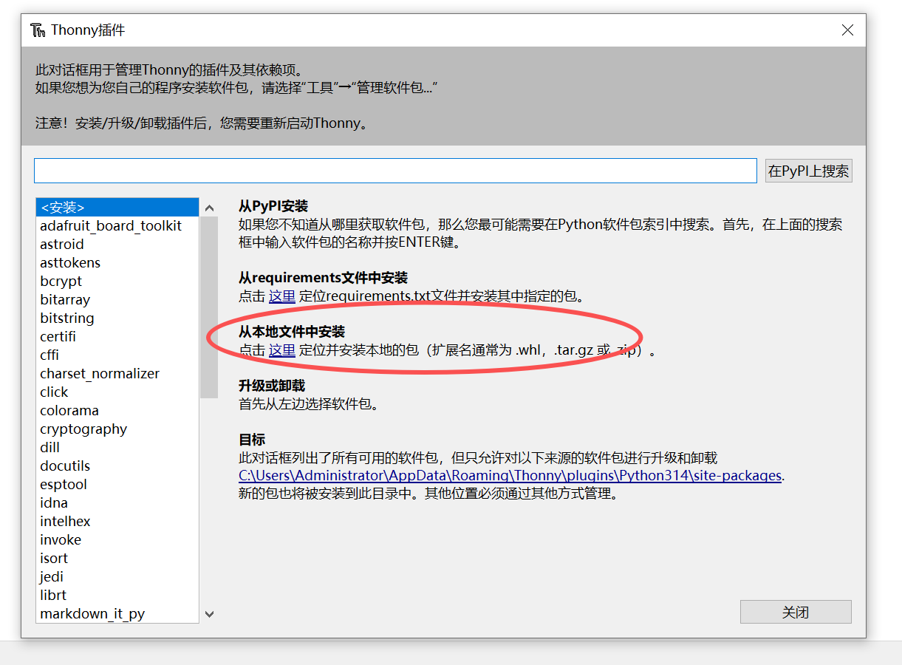

> **图片文字识别**：Thonny插件 此对话框用于管理Thonny的插件及其依赖项。 如果您想为您自己的程序安装软件包，请选择"工具"→"管理软件包." 注意！安装/升级/卸载插件后，您需要重新启动Thonny。 在PyPI上搜索 <安装> 从PyPI安装 adafruit_board_toolkit 如果您不知道从哪里获取软件包，那么您最可能需要在Python软件包索引中搜索。首先，在上面的搜索 astroid 框中输入软件包的名称并按ENTER键。 asttokens bcrypt 从requirements文件中安装 bitarray 点击 这里 定位requirements.txt文件并安装其中指定的包。 bitstring certifi 从本地文件中安装 cffi 点击这里定位并安装本地的包（扩展名通常为.whl，.tar.gz或 z charset_normalizer click 升级或卸载 colorama 首先从左边选择软件包。 cryptography 目标 dill docutils 此对话框列出了所有可用的软件包，但只允许对以下来源的软件包进行升级和卸载 C:\Users\Administrator\AppData\Roaming\Thonny\pluqins\Python314\site-packaqes. esptool 新的包也将被安装到此目录中。其他位置必须通过其他方式管理。 idna intelhex invoke isort jedi librt markdown_it_py 关闭

## 第 11 页

安装完成后，同样需要关闭并重新启动 Thonny，插件才会加载生效，重启后即可在工具栏看到插件图

标。​

重启之后，再次点击：​

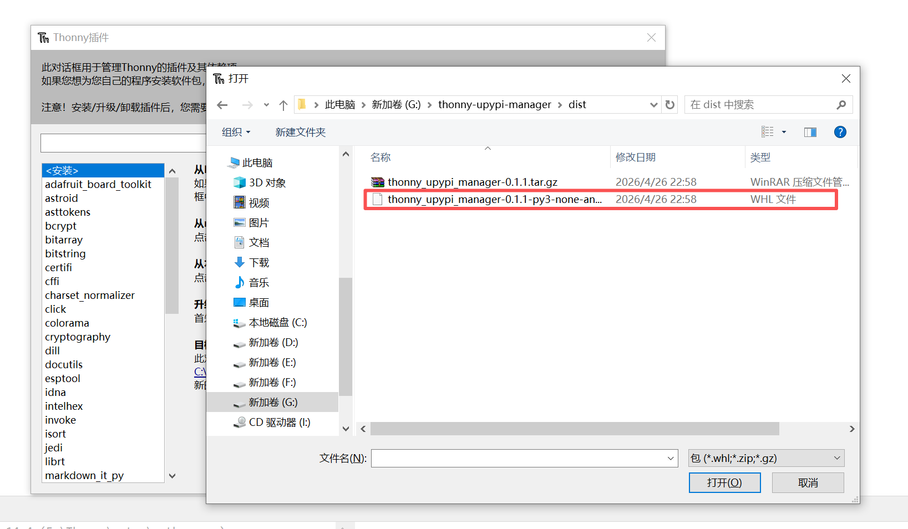

> **图片文字识别**：Thonny插件 此对话框用于管理Thonny的插件及其 如果您想为您自己的程序安装软件包， 打开 注意！安装/升级/卸载插件后， 您需要 ← 〉此电脑〉新加卷（G:）〉thonny-upypi-manager〉dist 在 dist 中搜索 组织 新建文件夹 名称 修改日期 类型 此电脑 <安装> 从 adafruit_board_toolkit 如 3D 对象 thonny_upypi_manager-0.1.1.tar.gz 2026/4/26 22:58 WinRAR 压缩文件管. astroid 框 视频 thonny_upypi_manager-0.1.1-py3-none-an.. 2026/4/26 22:58 WHL 文件 asttokens bcrypt 从 图片 点 bitarray 文档 bitstring 从 ← certifi 点 音乐 charset _normalizer 升 桌面 click 首 colorama 本地磁盘 (C:) cryptography 目 新加卷 (D:) dill 此 docutils 新加卷 (E:) C esptool 新 新加卷 (F:) idna intelhex 新加卷 (G:) invoke CD 驱动器 (l) isort jedi librt 文件名(N): 包 (*.whl;*.zip;*.gz) markdown_it_py 打开(Q) 取消

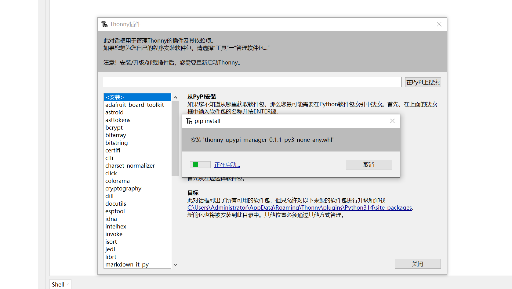

> **图片文字识别**：Thonny插件 此对话框用于管理Thonny的插件及其依赖项 如果您想为您自己的程序安装软件包，请选择"工具"→"管理软件包" 注意！安装/升级/卸载插件后，您需要重新启动Thonny。 在PyPI上搜索 <安装> 从PyPI安装 adafruit_board_toolkit 如果您不知道从哪里获取软件包，那么您最可能需要在Python软件包索引中搜索。首先，在上面的搜索 astroid 框中输入软件包的名称并按ENTER键 asttokens K pip install X bcrypt bitarray 安装'thonny_upypi_manager-0.1.1-py3-none-any.whl bitstring certifi charset_normalizer 正在启动. 取消 click colorama 自充从左边远择软件包。 cryptography 目标 dill 此对话框列出了所有可用的软件包，但只允许对以下来源的软件包进行升级和卸载 docutils C:\Users\Administrator\AppData\Roaming\Thonny\pluqins\Python314\site-packaqes. esptool 新的包也将被安装到此目录中。其他位置必须通过其他方式管理。 idna intelhex invoke isort jedi librt markdown_it _py 关闭 Shell

## 第 12 页

2.3 安装注意事项​

•
必须重启 Thonny：安装、升级或卸载插件后，都需要重启 Thonny，修改才能生效。​

•
mpremote 前置准备：插件安装完成后，需确保电脑已安装mpremote 工具（MicroPython 官

方串口工具），并配置到系统环境变量中，否则无法将包安装到开发板上。可通过命令行输入

mpremote --version 验证配置是否成功。​

•
依赖自动处理：插件依赖requests>=2.0 ，Thonny 的插件管理会自动安装该依赖，无需手动

操作。​

三、插件使用​

前面我们已经完成了插件的安装，接下来就跟着步骤，一步步上手用它来管理 MicroPython 包。整个

过程非常简单，只需要几步就能完成包的搜索、下载和安装，而且全程不用手动复制文件，省心又高

效。​

3.1 打开插件管理界面​

重启 Thonny 后，你会在顶部工具栏看到一个新的插件图标（就是红圈标注的那个图标），点击它就

能打开 uPyPi Package Manager 面板，面板会固定在 IDE 的侧边，方便后续操作。​

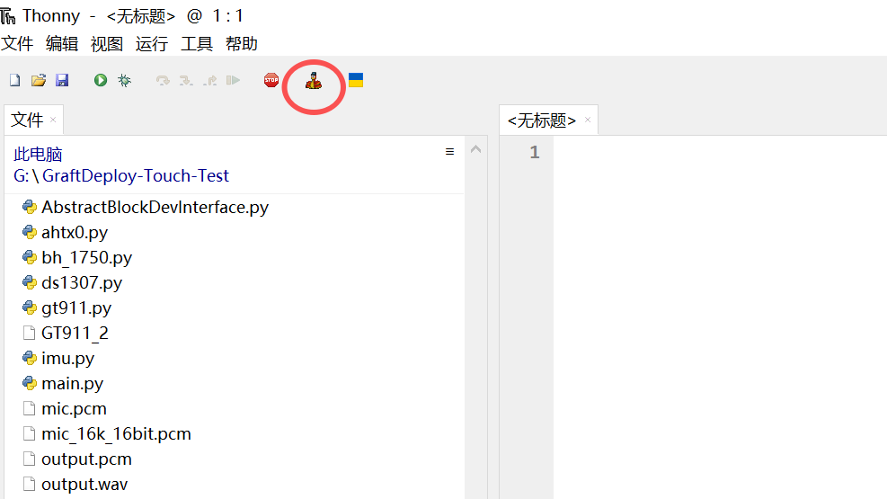

> **图片文字识别**：Thonny－<无标题>@1:1 文件  编辑 视图 运行 工具 帮助 文件 <无标题> 此电脑 1 G:\GraftDeploy-Touch-Test AbstractBlockDevlnterface.py 2 ahtx0.py 2 bh_1750.py ds1307.py gt911.py GT911_2 e imu.py main.py mic.pcm mic_16k_16bit.pcm output.pcm output.wav

## 第 13 页

3.2 设备连接​

在开始使用前，有两个准备步骤一定要做好，不然很容易出现安装失败的问题：​

把你的 MicroPython 开发板（比如 ESP32、ESP8266）用 USB 线连接到电脑，插件会自动识别串口

设备，设备下拉框里会显示对应的 COM 端口号（比如示例中的 COM55）。如果没识别到设备，点击

旁边的「Refresh Boards」按钮刷新一下，就能看到连接的设备了。​

注意，使用该插件时候，Thonny的终端不能连接设备！​

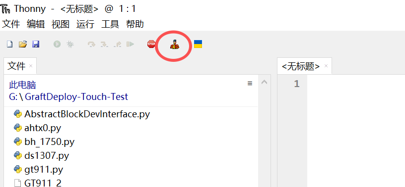

> **图片文字识别**：Thonny－<无标题>@1:1 文件 编辑 视图 运行 工具 帮助 TOP 文件 <无标题> 此电脑 1 G:\GraftDeploy-Touch-Test AbstractBlockDevlnterface.py ahtx0.py bh_1750.py ds1307.py gt911.py GT911.2

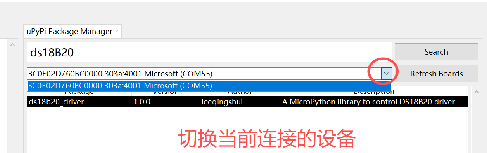

> **图片文字识别**：uPyPi Package Manager ds18B20 Search 3C0F02D760BC0000 303a:4001 Micr0soft (COM55) Refresh Boards 3C0F02D760BC0000 303a:4001 Micr0soft (COM55) LOICIA ds18b20 driver 1.0.0 leeqingshui A MicroPython library to control DS18B20 driver 切换当前连接的设备

## 第 14 页

这是新手最容易踩的坑：使用插件安装包时，Thonny 的终端不能连接开发板！ 串口设备同一时间只

能被一个程序占用，如果终端正在连接设备，插件就无法通过mpremote 和设备通信，会直接报错。​

解决方法很简单：看 Thonny 右下角的解释器选择，把它从 “MicroPython（连接设备的状态）” 切

到 “本地 Python3”，确保终端处于未连接状态，再继续后续操作。​

3.3 包搜索和下载/安装​

准备工作完成后，就可以开始找你需要的包了：​

1. 在面板上方的搜索框中输入包名，比如示例中的温度传感器驱动ds18B20 ；​

2. 点击右侧的「Search」按钮，下方的列表就会显示匹配的所有包，包括包名、版本、作者和功能描

述，方便你确认是不是自己需要的包。​

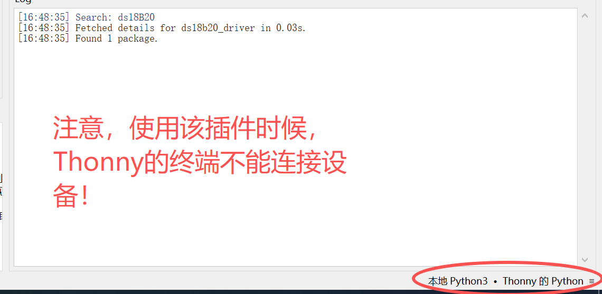

> **图片文字识别**：[16:48:35] Search: ds18B20 [16:48:35] Fetched details for ds18b20_driver in 0.03s. [16:48:35] Found 1 package. 注意，使用该插件时候 Thonny的终端不能连接设 备！ 本地 Python3·Thonny 的 Python

## 第 15 页

找到需要的包后，插件提供了两种处理方式，你可以根据自己的需求选择：​

> **图片文字识别**：文件 <无标题> uPyPi Package Manager 此电脑 1 ds18B20 Search G:\GraftDeploy-Touch-Test AbstractBlockDevlnterface.py 3C0F02D760BC0000 303a:4001 Micr0soft (COM55) Refresh Boards ahtx0.py bh_1750.py Package Version Author Description ds1307.py gt911.py GT911_2 imu.py main.py mic.pcm mic_16k_16bit.pcm output.pcm output.wav pcf8574.py sdcard.py sd _block_dev.py st7789.py test _4kbjpg test_5s.pcm vga1_16x16.py vga1_16x32.py vga1_8x8.py Download Package Install To Device Refresh Details Clear Log Log Shell Unable to connect to coM40: port not found Process ended with exit code 1. 器可以把输出到 系列数字可视 日信息请查看帮目 MicroPython (ESP32) · COM40 =

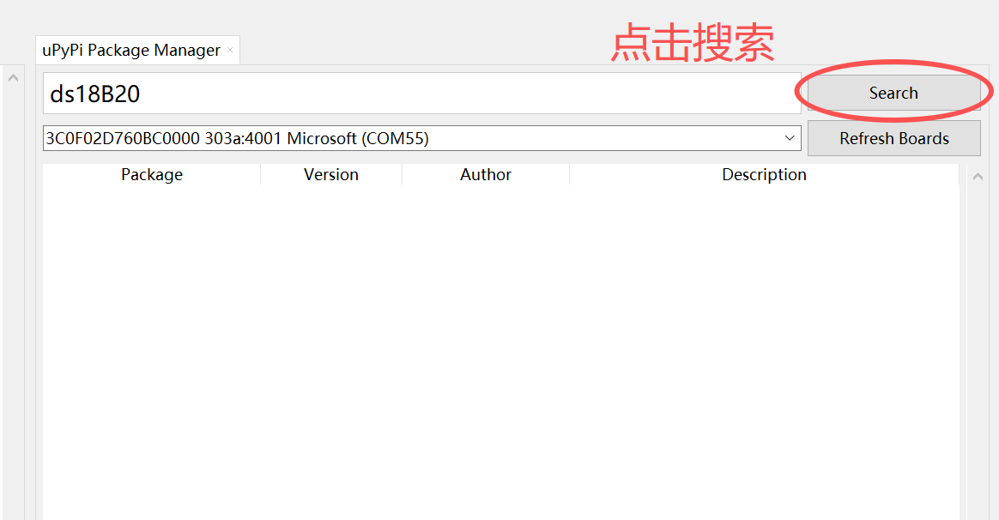

> **图片文字识别**：点击搜索 uPyPi Package Manager ds18B20 Search 3C0F02D760BC0000 303a:4001 Microsoft (COM55) Refresh Boards Package Version Author Description

## 第 16 页

•
下载到本地查看源码（Download Package）：如果你想先看看包的源码，或者后续要对驱动进行

修改，可以点击「Download Package」按钮。包会被下载到本地缓存目录，你可以在电脑上直接

查看和编辑代码，再手动传到开发板上。​

•
一键安装到开发板（Install To Device）：这是最推荐的方式，全程自动化：点击「Install To

Device」后，插件会自动完成以下操作：​

◦下载包文件（包括多文件包的所有文件）；​

◦自动读取package.json 中的依赖，先安装所有依赖库；​

◦通过mpremote 工具，把所有文件上传到开发板的/lib 目录中。整个过程不用你手动操作

任何一步，非常省心。​

也支持模糊搜索：​

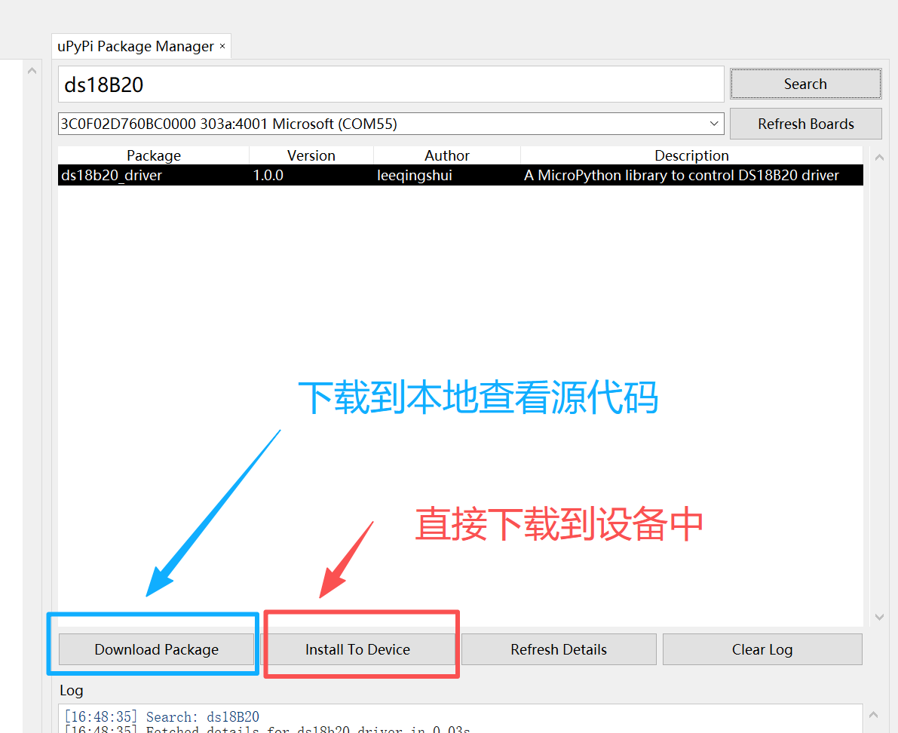

> **图片文字识别**：uPyPi Package Manager x ds18B20 Search 3C0F02D760BC0000 303a:4001 Microsoft (COM55) Refresh Boards Package Version Author Description ds18b20_driver 1.0.0 leeqingshui A MicroPython library to control DS18B20 driver 下载到本地查看源代码 直接下载到设备中 Download Package Install To Device Refresh Details Clear Log Log [16:48:35] Search: ds18B20

## 第 17 页

插件支持模糊搜索，就算你记不清完整包名，只输入关键词也能找到相关的包。比如只输入

“ ds ”，就能看到所有和 DS  系列传感器相关的驱动包，不用死记硬背包名，找包更轻松。​

3.4 查看安装日志与验证结果​

安装过程中，下方的「Log」区域会实时显示操作进度，你可以通过日志了解当前状态：​

•
比如看到Searching: ds18B20 「Downloading files」等信息，说明插件正在正常工作；​

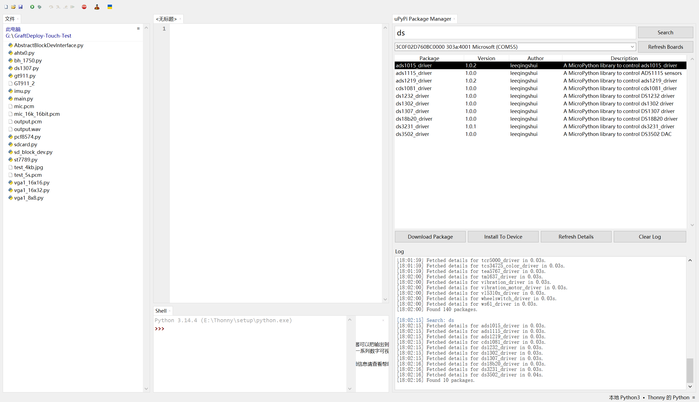

> **图片文字识别**：> 文件 <无标题> uPyPi Package Manager 此电脑 1 ds Search G:\GraftDeploy-Touch-Test AbstractBlockDevlnterface.py 3C0F02D760BC0000 303a:4001 Microsoft (COM55) Refresh Boards ahtx0.py bh_1750.py Package Version Author Description ds1307.py ads1015_driver 1.0.2 leeqingshui A MicroPython library to control ads1015_driver gt911.py ads1115_driver 1.0.0 leeqingshui A MicroPython library to control ADS1115 sensors ads1219_driver GT911_2 1.0.2 leeqingshui A MicroPython library to control ads1219_driver eimu.py cds1081_driver 1.0.0 leeqingshui A MicroPython library to control cds1081_driver main.py ds1232_driver 1.0.0 leeqingshui A MicroPython library to control DS1232 driver mic.pcm ds1302_driver 1.0.0 leeqingshui A MicroPython library to control ds1302 driver mic_16k_16bit.pcm ds1307_driver 1.0.0 leeqingshui A MicroPython library to control DS1307 driver ds18b20_driver 1.0.0 leeqingshui output.pcm A MicroPython library to control DS18B20 driver output.wav ds3231_driver 1.0.1 leeqingshui A MicroPython library to control ds3231_driver pcf8574.py ds3502_driver 1.0.0 leeqingshui A MicroPython library to control DS3502 DAC sdcard.py sd_block_dev.py st7789.py test _4kbjpg test_5s.pcm vga1_16x16.py vga1_16x32.py vga1_8x8.py Download Package Install To Device Refresh Details Clear Log Log [18:01:59] Fetched details for tcr5000_driver in 0. 03s. [18:01:59] Fetched details for tcs34725_color_driver in 0.03s. [18:01:59] Fetched details for tea5767_driver in 0.03s. [18:02:00] Fetched details for tml637_driver in 0.03s. [18:02:00] Fetched details for vibration_driver in 0. 03s. [18:02:00] Fetched details for vibration_motor_driver in 0. 03s. [18:02:00] Fetched details for v15310x_driver in 0.03s. [18:02:00] Fetched details for wheelswitch_driver in 0. 03s. [18:02:00] Fetched details for ws6l_driver in 0.03s. Shell [18:02:00] Found 140 packages. Python 3.14.4（E:\Thonny\setup\python.exe) [18:02:15] Search: ds [18:02:15] Fetched details for ads1015_driver in 0. 03s. >>> [18:02:15] Fetched details for adsll15_driver in 0.03s. [18:02:15] Fetched details for ads1219_driver in 0. 03s. 器可以把输出到 [18:02:15] Fetched details for cds1081_driver in 0.03s. [18:02:15] Fetched details for ds1232_driver in 0. 03s. 一系列数字可视 [18:02:15] Fetched details for ds1302_driver in 0. 03s. [18:02:15] Fetched details for ds1307_driver in 0.03s. 日信息请查看帮目 [18:02:16] Fetched details for ds18b20_driver in 0.03s. [18:02:16] Fetched details for ds3231_driver in 0. 03s. [18:02:16] Fetched details for ds3502_driver in 0. 04s. [18:02:16] Found 10 packages. 本地 Python3·Thonny的 Python =

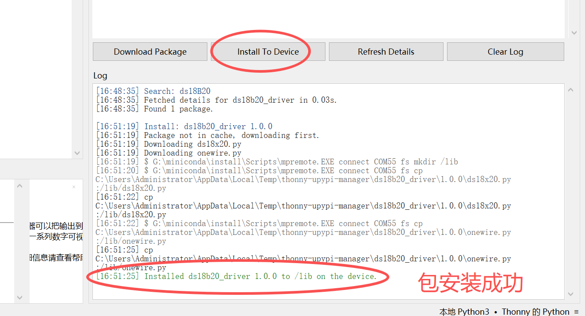

> **图片文字识别**：Download Package Install To Device Refresh Details Clear Log Log [16:48:35] Search: ds18B20 [16:48:35] Fetched details for ds18b20_driver in 0.03s. [16:48:35] Found 1 package. [16:51:19] Insta11: ds18b20_driver 1.0.0 [16:51:19] Package not in cache, downloading first. [16:51:19] Downloading ds18x20. py [16:51:19] Downloading onewire. py [16:51:19] $ G:\miniconda\install\Scripts\mpremote.EXE connect CoM55 fs mkdir /1ib e s C: \Users\Administrator\AppData\Local\Temp\thonny-upypi-manager\ds18b20_driver\1. 0. 0\ds18x20. py : /1ib/ds18x20. py [16:51:22] cp C:\Users\Administrator\AppData\Local\Temp\thonny-upypi-manager\ds18b20_driver\1. 0. 0\ds18x20. py :/1ib/ds18x20. py [16:51:22] S G:<miniconda\instal1\Scripts\mpremote. EXE connect COM55 fs cp 器可以把输出到 C:\Users\Administrator\AppData\Local\Temp\thonny-upypi-manager\ds18b20_driver\1. 0. 0\onewire. py 系列数字可视 : /lib/onewire. py [16:51:25]  cp 日信息请查看帮目 C:\Users\Administrator\AnpData\Local\Tomp\thonnv-upypi-manager\ds18b20_driver\1. 0. 0\onewire. py onewire. py [16:51:25] Installed ds18b20_driver 1.0.0 to /lib on the device. 包安装成功 本地 Python3·Thonny 的 Python

## 第 18 页

•
当出现Installed xxx to /lib on the device 这样的提示时，就说明包已经成功安装

到开发板上了。​

如果日志内容太多，影响查看新的信息，可以点击「Clear Log」按钮清空日志，方便后续操作。​

安装完成后，把 Thonny 的解释器切回 MicroPython，打开开发板的文件系统，就能在/lib 目录里

看到刚安装的包文件了，这时候就可以直接在代码里import 使用了。​

附件-本地安装包​

thonny_upypi_manager-0.1.1-py3-
none-any.whl

17.05KB

thonny_upypi_manager-
0.1.1.tar.gz

18.00KB

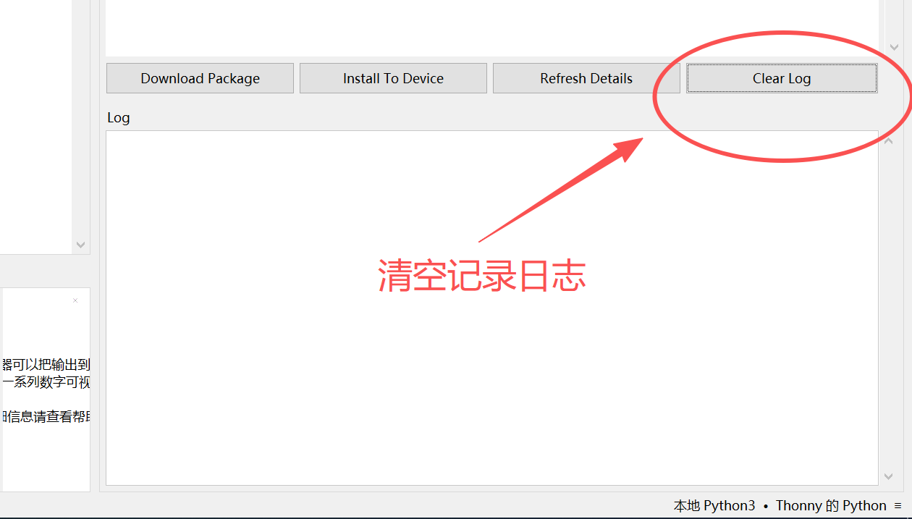

> **图片文字识别**：Download Package Install To Device Refresh Details Clear Log Log 清空记录日志 器可以把输出到 系列数字可视 日信息请查看帮目 本地 Python3·Thonny 的 Python =

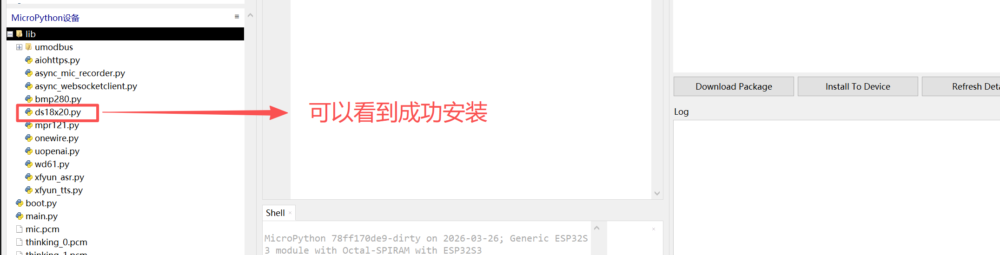

> **图片文字识别**：MicroPython设备 lib 山 umodbus aiohttps.py async_mic_recorder.py async_websocketclient.py Download Package Install To Device Refresh Det bmp280.py ds18x20.py 可以看到成功安装 Log mpr121.py onewire.py uopenai.py wd61.py xfyun_asr.py xfyun_tts.py boot.py main.py Shell mic.pcm thinking_0.pcm MicroPython 78ff170de9-dirty on 2026-03-26; Generic ESP32S module withOctal-SPIRAM withESP32S3

## 第 19 页

版本记录​

版本号
修订时间
修改人
修改内容

v1.0​
2026-04-27​
lee二勇​
初始化版本。

v1.2​
2026-04-28​
lee二勇​
补充了 miniconda 的安装。​

​
​
​
​

​
​
​
​

​
​
​
​

​
​
​
​

