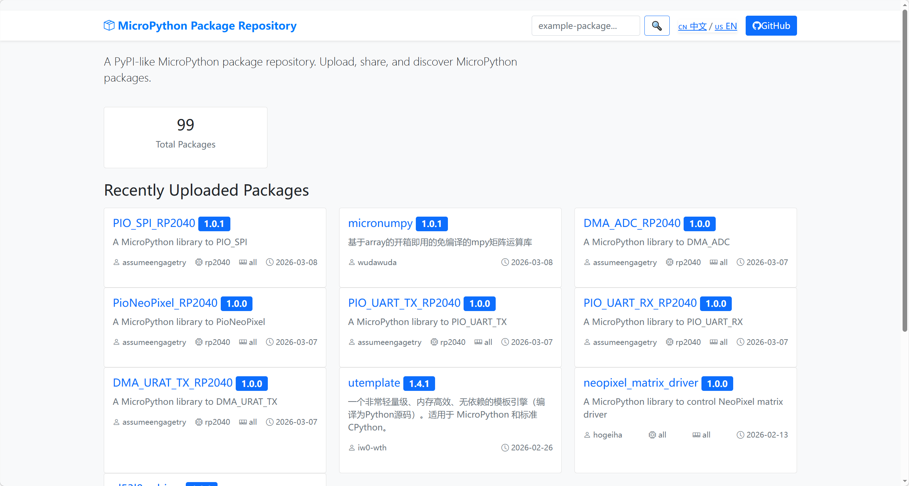
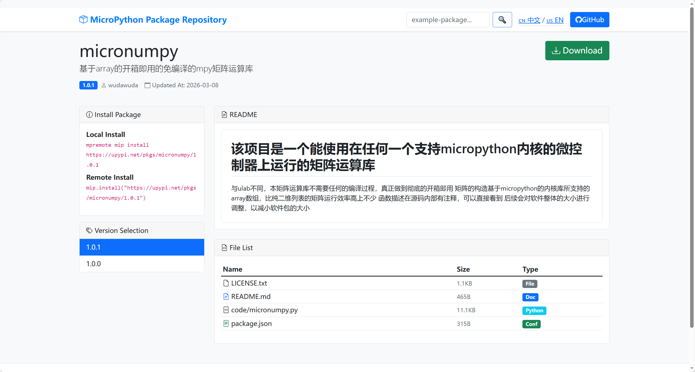
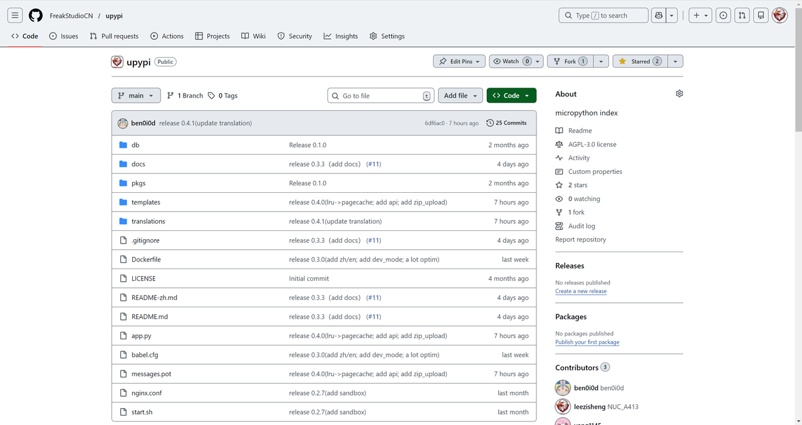
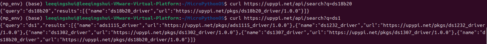
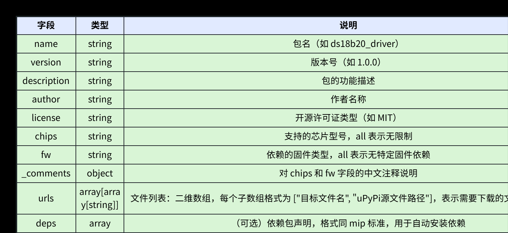
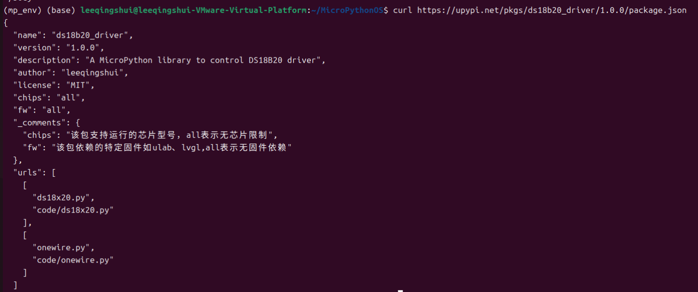
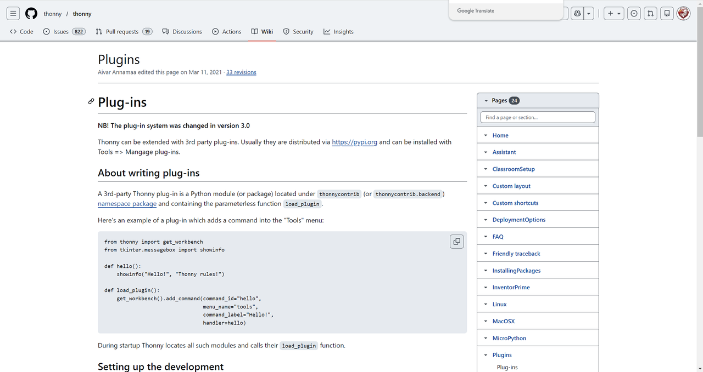
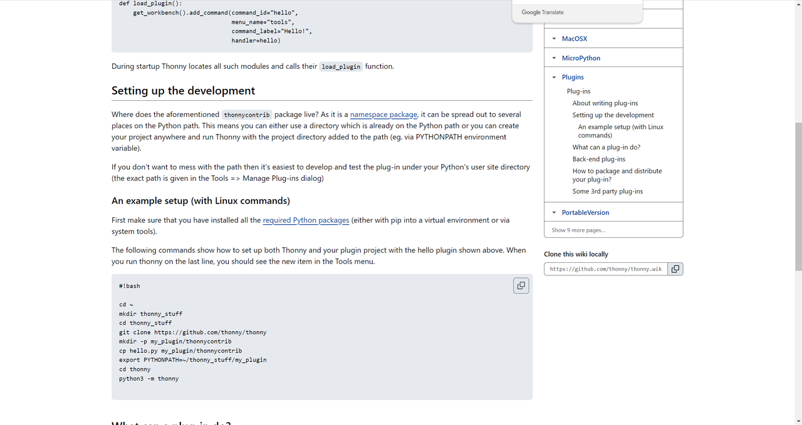
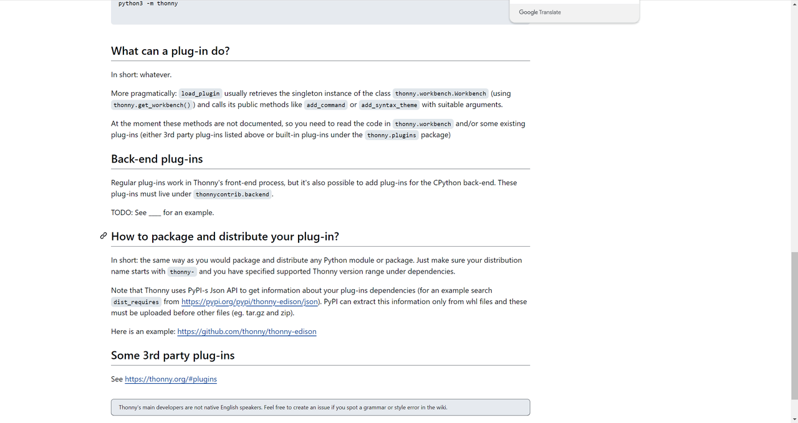

# Thonny-uPyPi 包管理插件需求规格说明书

> 源文件：`dev/Thonny-uPyPi 包管理插件需求规格说明书.pdf` · 共 8 页

## 第 1 页

Thonny-uPyPi 包管理插件需求规格说明书​

一、文档概述​

1.1 文档目的​

本文档定义了 Thonny-uPyPi 包管理插件 的功能需求、非功能需求与开发规范，用于指导插件的设

计、开发与验收，实现 Thonny 与 uPyPi（MicroPython 包仓库）的无缝集成。​

1.2 背景与目标​

uPyPi 是类 PyPI 的 MicroPython 包仓库，提供包上传、搜索、下载与分发能力：https://upypi.net/​

> **图片文字识别**：MicroPython Package Repository example-package... CN中文/us EN QGitHub A PyPl-like MicroPython package repository. Upload, share, and discover MicroPython packages. 99 Total Packages Recently Uploaded Packages PIO_SPI_RP2040 1.0.1 micronumpy 1.0.1 DMA_ADC_RP2040 1.0.0 A MicroPython library to PlO_SPI 基于array的开箱即用的免编译的mpy矩阵运算库 A MicroPython library to DMA_ADC assumeengagetryO rp2040 all 2026-03-08 8 wudawuda 2026-03-08 assumeengagetry  rp2040 m all① 2026-03-07 PioNeoPixel RP2040 1.0.0 PIO_UART_TX_RP2040 1.0.0 PIO_UART_RX_RP2040 1.0.0 A MicroPython library to PioNeoPixel A MicroPython library to PIO_UART_TX A MicroPython library to PIO_UART_RX 8 assumeengagetry  rp2040  all① 2026-03-07 assumeengagetry rp2040 all① 2026-03-07 assumeengagetry rp2040 all① 2026-03-07 DMA_URAT_TX_RP2040 1.0.0 utemplate 1.4.1 neopixel_matrix_driver 1.0.0 A MicroPython library to DMA_URAT_TX 一个非常轻量级、内存高效、无依赖的模板引擎（编 A MicroPython library to control NeoPixel matrix 译为Python源码）。适用于 MicroPython 和标准 driver 8 assumeengagetry  rp2040 m all ① 2026-03-07 CPython。 8 hogeiha oall 目all 2026-02-13 8 iw0-wth 2026-02-26

## 第 2 页

源代码地址：https://github.com/FreakStudioCN/upypi​

需要开发 Thonny 第三方插件，让开发者在 Thonny 内即可搜索、浏览 uPyPi 包，并一键通过

mpremote  安装到开发板，提升 MicroPython 开发效率：​

•
适用于 Thonny 较新版本​

•
适用于所有支持 MicroPython 的开发板（通过 mpremote  连接）​

•
遵循 Thonny 插件开发规范（thonnycontrib  命名空间、load_plugin  入口函数）​

> **图片文字识别**：MicroPython Package Repository example-package... CN 中文/us EN QGitHub micronumpy Download 基于array的开箱即用的免编译的mpy矩阵运算库 1.0.1 8wudawuda Updated At:2026-03-08 ① Install Package README Local Install mpremote mip install 该项目是一个能使用在任何一个支持micropython内核的微控 https://upypi.net/pkgs/micronumpy/1 .0.1 制器上运行的矩阵运算库 Remote Install mip.install("https://upypi.net/pkgs 与ulab不同，本矩阵运算库不需要任何的编译过程，真正做到彻底的开箱即用矩阵的构造基于micropython的内核库所支持的 /micronumpy/1.0.1") array数组，比纯二维列表的矩阵运行效率高上不少函数描述在源码内部有注释，可以直接看到后续会对软件整体的大小进行 调整，以减小软件包的大小 Version Selection 1.0.1 File List 1.0.0 Name Size Type LICENSE.txt 1.1KB File README.md 465B Doc code/micronumpy.py 11.1KB Python package.json 315B Conf

> **图片文字识别**：FreakStudioCN /upypi QTypeto search <>Code IssuesI Pullrequests Actions Projects wiki Security InsightsSettings ? upypi Public Edit Pins Wath- Fork ★Starred② main 1Branch 0Tags Q Go to file ? Add file <>Code About 章 micropython index ben0iod release 0.4.1(update translation) 6df6ac0·7hours ago  25 Commits Readme 口 db Release 0.1.0 2 months ago AGPL-3.0 license Activity 口 docs release 0.3.3 (add docs) (#11) 4 days ago Custom properties 口 pkgs Release 0.1.0 2 months ago ☆2stars templates release 0.4.0(lru->pagecache; add api; add zip_upload) 7 hours ago 0 watching 1fork translations release 0.4.1(update translation) 7 hours ago Audit log gitignore release 0.3.3 (add docs) (#11) 4 days ago Report repository Dockerfile release 0.3.0(add zh/en; add dev_mode; a lot optim) last week Releases LICENSE Initial commit 4 months ago No releases published README-zh.md Create a new release release 0.3.3 (add docs) (#11) 4 days ago README.md release 0.3.3 (add docs) (#11) 4 days ago Packages app-py release 0.4.0(ru->pagecache; add api; add zip_upload) 7 hours ago No packages published Publish your first package babel.cfg release 0.3.0(add zh/en; add dev_mode; a lot optim) last week Contributors ③ D messages.pot release 0.4.0(lru->pagecache; add api; add zip_upload) 7 hours ago nginx.conf release 0.2.7(add sandbox) last month benoiod ben0iod start.sh release 0.2.7(add sandbox) last month leezisheng NUC_A413

## 第 3 页

二、核心功能需求​

2.1 插件入口与界面​

•
入口展示：在 Thonny 主界面新增「uPyPi 包管理」菜单 / 面板入口（可在「工具」菜单或侧边栏

展示），支持打开 / 关闭插件面板。​

•
界面布局：​

◦顶部：搜索框 + 搜索按钮​

◦中部：搜索结果列表（支持分页 / 滚动）​

◦底部：安装日志 / 状态提示区​

2.2 包搜索功能​

1. 搜索触发：用户输入包名关键词，点击搜索按钮或按回车键，发起搜索请求。​

2. API 调用：​

◦调用 uPyPi 搜索接口：GET https://upypi.net/api/search?q={关键词} ​

◦接口响应格式：JSON，包含 query （搜索关键词）和 results （结果数组），每个结果

项包含 name （包名）和 url （包详情地址，格式为 https://upypi.net/pkgs/{包

名}/{版本号}/ ）​

◦支持模糊搜索：接口会自动匹配包含关键词的包名，返回所有相关结果​

3. 结果展示：​

◦核心信息展示：​

▪包名：直接从搜索结果的 name  字段获取​

▪最新版本号、作者、简短描述：通过包详情接口（拼接 url  + package.json ）获取并

展示​

▪上传时间：若 uPyPi 接口 / 包详情中提供该字段则展示，否则显示 “暂无”​

◦状态提示：​

▪空结果提示：当 results  数组为空时，显示「未找到匹配的包，请尝试其他关键词」​

▪搜索错误提示：当接口请求失败（如网络错误、服务端异常）时，显示「搜索失败，请检查

网络后重试」​

▪加载中提示：搜索请求发起后，显示加载动画或「正在搜索…」提示，提升交互体验​

2.3 包下载与安装功能​

•
下载操作：​

## 第 4 页

◦点击「下载」按钮，获取 uPyPi 包的下载链接（如 https://upypi.net/pkgs/{包

名}/{版本号}/ ）​

◦下载包文件（.py  或 .mpy  格式）到本地临时目录或 Thonny 项目目录​

•
安装操作：​

◦点击「安装到开发板」按钮，调用 mpremote  命令将包文件上传到开发板的 /lib  目录​

◦命令示例：mpremote cp {本地包路径} :/lib/{包名}.py ​

•
状态反馈：​

◦实时显示下载 / 安装进度​

◦安装成功 / 失败提示（弹窗或底部日志区）​

◦失败时展示具体错误信息（如 mpremote  未安装、开发板未连接）​

三、接口与依赖设计​

3.1 uPyPi API 依赖​

•
搜索接口：GET https://upypi.net/api/search?q={query} ​

◦响应格式：JSON，包含 name 、url 字段​

代码块​

1

(mp_env) (base) leeqingshui@leeqingshui-VMware-Virtual-

Platform:~/MicroPythonOS$ curl https://upypi.net/api/search?q=ds18b20​

2

{"query":"ds18b20","results":

[{"name":"ds18b20_driver","url":"https://upypi.net/pkgs/ds18b20_driver/1.0.0"}]

}​

3

(mp_env) (base) leeqingshui@leeqingshui-VMware-Virtual-

Platform:~/MicroPythonOS$ curl https://upypi.net/api/search?q=ds1​

4

{"query":"ds1","results":

[{"name":"ads1115_driver","url":"https://upypi.net/pkgs/ads1115_driver/1.0.0"},

{"name":"ds1232_driver","url":"https://upypi.net/pkgs/ds1232_driver/1.0.0"},

{"name":"ds1302_driver","url":"https://upypi.net/pkgs/ds1302_driver/1.0.0"},

{"name":"ds1307_driver","url":"https://upypi.net/pkgs/ds1307_driver/1.0.0"},

{"name":"ds18b20_driver","url":"https://upypi.net/pkgs/ds18b20_driver/1.0.0"}]}​

5

(mp_env) (base) leeqingshui@leeqingshui-VMware-Virtual-

Platform:~/MicroPythonOS$ ​

•
包详情接口：GET https://upypi.net/pkgs/{包名}/{版本号}/package.json ​

> **图片文字识别**：（mp_env)（base）leeqingshui@leeqingshui-vMware-Virtual-Platform:~/MicroPython0sscurlhttps://upypi.net/api/search?q=ds18b20 ["query":"ds18b20","results":[f"name":"ds18b20_driver","url":"https://upypi.net/pkgs/ds18b20_driver/1.0.0"}]} (mp_env)(base)leeqingshui@leeqingshui-vMware-Virtual-Platform:~/MicroPythonosscurlhttps://upypi.net/api/search?q=ds1 {"query":"ds1","results":[f"name":"ads1115_driver","url":"https://upypi.net/pkgs/ads1115_driver/1.0.0"},{"name":"ds1232_driver","url":"https://upypi.net/pkgs/ds1232_driver /1.0.0"},{"name":"ds1302_driver","url":"https://upypi.net/pkgs/ds1302_driver/1.0.0"},f"name":"ds1307_driver","url":"https://upypi.net/pkgs/ds1307_driver/1.0.0"},f"name":"d s18b20_driver","url":"https://upypi.net/pkgs/ds18b20_driver/1.0.0"}]}

## 第 5 页

◦响应格式：直接返回该版本包的 package.json  文件，JSON 结构包含以下核心字段：​

代码块​

1

(mp_env) (base) leeqingshui@leeqingshui-VMware-Virtual-

Platform:~/MicroPythonOS$ curl

https://upypi.net/pkgs/ds18b20_driver/1.0.0/package.json​

2

{​

3

"name": "ds18b20_driver",​

4

"version": "1.0.0",​

5

"description": "A MicroPython library to control DS18B20 driver",​

6

"author": "leeqingshui",​

7

"license": "MIT",​

8

"chips": "all",​

9

"fw": "all",​

10

"_comments": {​

11

"chips": "该包支持运行的芯片型号，all表示无芯片限制",​

> **图片文字识别**：字段 类型 说明 name string 包名(如 ds18b20_driver) version string 版本号 (如1.0.0) description string 包的功能描述 author string 作者名称 license string 开源许可证类型 (如MIT) chips string 支持的芯片型号，all表示无限制 fw string 依赖的固件类型，all表示无特定固件依赖 comments object 对chips和fw字段的中文注释说明 array[arra urls y[string]] deps array （可选）依赖包声明，格式同mip标准，用于自动安装依赖

> **图片文字识别**：(mp_env）(base） leeqingshui@leeqingshui-vMware-Virtual-Platform:~/MicroPython0s$ curl https://upypi.net/pkgs/ds18b20_driver/1.0.0/package.json "name":"ds18b20_driver" "version":"1.0.0", "description":"A MicroPythonlibrary tocontrolDS18B20driver", "author":"leeqingshui", "license":"MIT", "fw": "all", _comments":{ "chips"："该包支持运行的芯片型号，all表示无芯片限制"， "fw"："该包依赖的特定固件如ulab、lvgl,all表示无固件依赖" urls":[ "ds18x20.py", "code/ds18x20.py" "onewire.py", "code/onewire.py"

## 第 6 页

12

"fw": "该包依赖的特定固件如ulab、lvgl,all表示无固件依赖"​

13

},​

14

"urls": [​

15

[​

16

"ds18x20.py",​

17

"code/ds18x20.py"​

18

],​

19

[​

20

"onewire.py",​

21

"code/onewire.py"​

22

]​

23

]​

24

}​

3.2 Thonny 插件 API 依赖​

•
入口函数：load_plugin() ，用于注册插件到 Thonny​

•
工作台接口：get_workbench() ，用于创建面板、添加菜单​

•
进程调用接口：用于执行 mpremote  命令并获取输出​

3.3 外部工具依赖​

•
mpremote ：必须已安装并配置到系统 PATH，用于开发板通信​

•
Python 3.8+：Thonny 内置 Python 环境需满足版本要求​

四、开发规范​

•
包名：thonny-upypi-manager （以 thonny-  开头，符合 Thonny 插件命名规范）​

•
打包格式：wheel （.whl ），便于上传到 PyPI​

•
setup.py / pyproject.toml  中声明依赖：mpremote 、requests （用于 API 调用）​

•
声明支持的 Thonny 版本范围：>=3.0,<5.0 ​

五、验收标准​

•
功能验收：​

◦插件能正常在 Thonny 中加载，入口可见​

◦搜索功能能正确返回 uPyPi 上的包信息​

◦能正常下载包并通过 mpremote  安装到开发板​

◦错误场景（无网络、开发板未连接）能正确提示​

## 第 7 页

•
兼容性验收：​

◦在 Windows/macOS/Linux 下均能正常运行​

版本记录​

版本号
修改人员
时间
内容​

v1.0​
李子圣
2026/03/1

初始化文档。​

3​

v1.1​
李子圣
2026/03/1

修改2.2包搜索功能。​

3​

​
​
​
​

​
​
​
​

相关参考​

> **图片文字识别**：thony/ thonny Google Translate <>Code Issues 822 Pullrequests 9 Discussions Actions wiki Security Insights Plugins Aivar Annamaa edited this page on Mar 11, 2021 · 3 revisions Pages 24 Find a page or section.. NB! The plug-in system was changed in version 3.0 Home Thonny can be extended with 3rd party plug-ins. Usually they are distributed via https://pypi.org and can be installed with Tools => Mangage plug-ins. Assistant About writing plug-ins ClassroomSetup Custom layout namespace package and containing the parameterless function load_plugin . Custom shortcuts Here's an example of a plug-in which adds a command into the “Tools” menu: DeploymentOptions FAQ from thonny import get_workbench from tkinter.messagebox import showinfo Friendly traceback def hello(): InstallingPackages showinfo("Hello!", “Thonny rules!") def load_plugin(): InventorPrime get_workbench().add_command(command_id="hello", menu_name="tools", Linux command_1abel="Hello!", handler=hello) MacOsx MicroPython subn|d Settingupthedevelopment Plug-ins

## 第 8 页

https://thonny.org/#plugins​

https://github.com/thonny/thonny/wiki/Plugins​

https://github.com/FreakStudioCN/upypi​

> **图片文字识别**：def 1oad_plugin(): get_workbench().add_command(command_id="hello", Google Translate menu_namea"tools", command_label="Hello1", handler=hello) MacOSX MicroPython During startup Thonny locates allsuch modules and calls their load_plugin function. Plugins Setting up the development Plug-ins About writing plug-ins Where does the aforementioned thonnycontrib package live? As it is a namespace package it can be spread out to several Setting up the development places on the Python path. This means you can either use a directory which is already on the Python path or you can create An example setup (with Linux your project anywhere and run Thonny with the project directory added to the path (eg.via PYTHONPATH environment commands) variable). What can a plug-in do? Back-end plug-ins If you dont want to mess with the path then it's easiest to develop and test the plug-in under your Python's user site directory How to package and distribute (the exact path is given in the Tools => Manage Plug-ins dialog) u-5nd no Some 3rd party plug-ins Anexamplesetup(withLinuxcommands) PortableVersion First make sure that you have installed all the required Python packages (either with pip into a virtual environment or via system tools). Show 9 more pages... The following commands show how to set up both Thonny and your plugin project with the hello plugin shown above. When Clone this wiki locally you run thonny on the last line, you should see the new item in the Tools menu. https://github.com/thonny/thonny.wik #!bash 凸 cd~ mkdir thonny_stuff cd thonny_stuff git clone https://github.com/thonny/thonny mkdir -p my_plugin/thonnycontrib cp hello.py my_plugin/thonnycontrib export PYTHoNPATH=~/thonny_stuff/my_plugin cd thonny python3 -m thonny

> **图片文字识别**：python3-m thonny Google Translate What can a plug-in do? In short: whatever. More pragmatically: load_plugin usually retrieves the singleton instance of the class thonny.workbench.Workbench (using thonny.get_workbench() ) and calls its public methods like add_command or add_syntax_theme with suitable arguments. At the moment these methods are not documented, so you need to read the code in thonny.workbench and/or some existing plug-ins (either 3rd party plug-ins listed above or built-in plug-ins under the thonny.plugins package) Back-end plug-ins Regular plug-ins work in Thonny's front-end process, but it's also possible to add plug-ins for the CPython back-end. These plug-ins must live under thonnycontrib.backend . TODO: See. for an example. How topackage and distributeyour plug-in? In short: the same way as you would package and distribute any Python module or package. Just make sure your distribution Note that Thonny uses PyPl-s Json API to get information about your plug-ins dependencies (for an example search dist_requires from https://pypi.org/pypi/thonny-edison/json). PyPl can extract this information only from whl fles and these must be uploaded before other files (eg. tar.gz and zip). Here is an example: https://github.com/thonny/thonny-edison Some 3rd party plug-ins See https://thonny.org/#plugins Thonny's main developers are not native English speakers. Feel free to create an issue if you spot a grammar or style err in the wiki.

