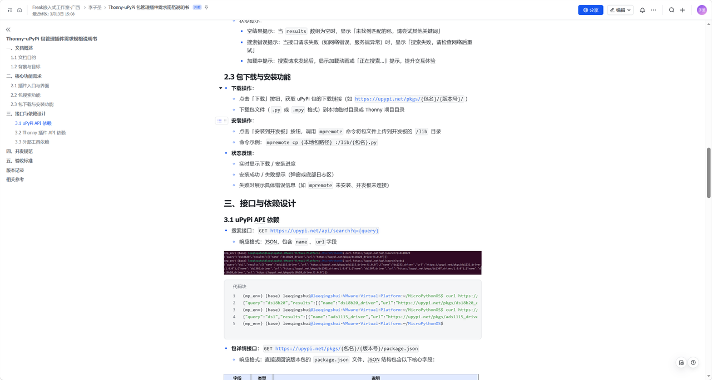
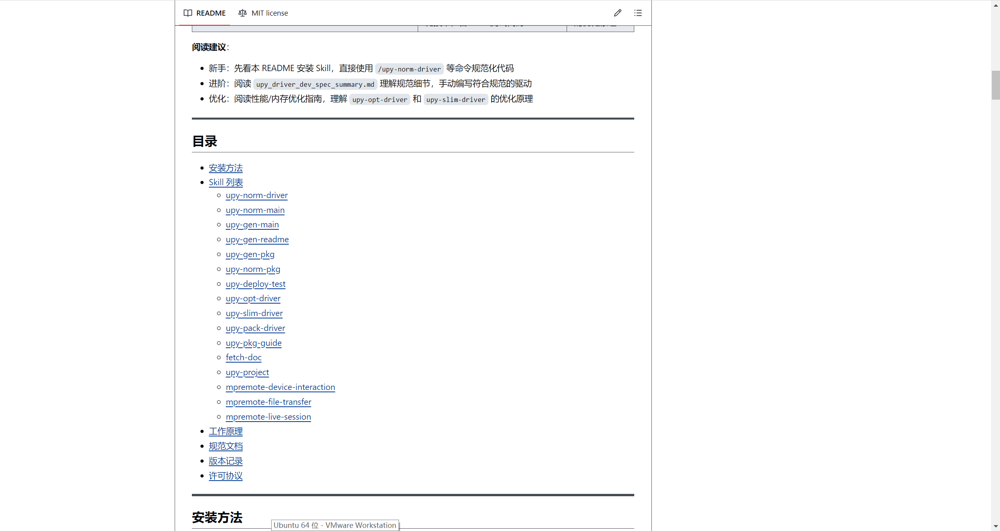
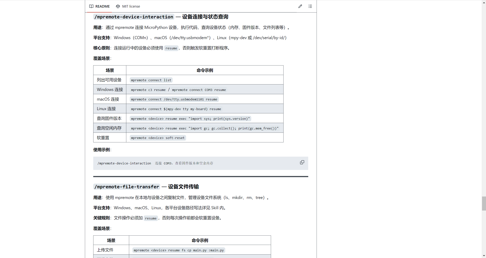
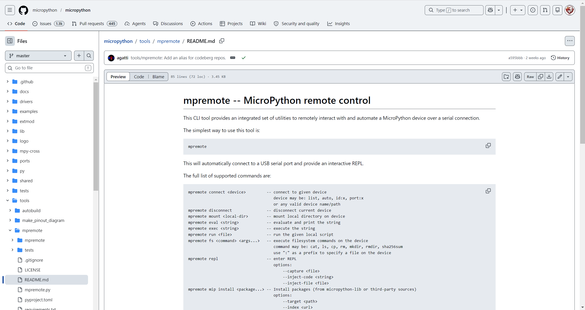

# 一句话生硬件-相关资料文档

> 源文件：`dev/一句话生硬件-相关资料文档.pdf` · 共 3 页

## 第 1 页

一句话生硬件-相关资料文档​

upypi API接口和thonny-upypi-manager包管理插件​

查看：​
Thonny-uPyPi 包管理插件需求规格说明书​

thonny-upypi-manager包管理插件代码如下：​

thonny-upypi-manager-main.rar

60.33KB

使用可看：​

Thonny中Mpy包管理器插件的安装和使用​

skill相关仓库​

https://github.com/FreakStudioCN/MicroPython_Skills​

> **图片文字识别**：Freak嵌入式工作室-广西》李子圣>Thony-uPyP包管理插件需求规格说明书景 分享 最近修改：3月13日15:08 编辑 Q+ 认芯旋小， 《 ·空结果提示：当results数组为空时，显示「未找到匹配的包，请尝试其他关键词] Thonny-uPyPi包管理插件需求规格说明书 ·搜索错误提示：当接口请求失败（如网络错误、服务端异常）时，显示「搜索失败，请检查网络后重 一、文档概述 试 1.1文档目的 ·加载中提示：搜索请求发起后，显示加载动画或「正在搜索.」提示，提升交互体验 1.2背景与目标 二、核心功能需求 2.3包下载与安装功能 2.1 插件入口与界面 ·下载操作： 2.2包搜索功能 2.3包下载与安装功能 。点击「下载」按钮，获取uPyPi包的下载链接（如https://upypi.net/pkgs/（包名}/{版本号}/） 三、接口与依预设计 。下载包文件（·py或mpy格式）到本地临时目录或Thonny项目目录 3.1 uPyPI API 依赖 三三安装操作： 3.2 Thonny 插件 API 依赖 。点击「安装到开发板」按钮，调用premote命令将包文件上传到开发板的/lib目录 3.3外部工具依赖 。命令示例：mpremote cp（本地包路径）：/lib/（包名）·py 四、开发规范 状态反馈： 五、验收标准 。实时显示下载/安装进度 版本记录 相关参考 。安装成功/失败提示（弹窗或底部日志区） 。失败时展示具体错误信息（如mpremote未安装、开发板未连接） 三、接口与依赖设计 3.1uPyPiAPI依赖 搜索接口：GET https://upypi.net/api/search?q={query} 。响应格式：JSON，包含name、ur1字段 15 cerl https:/ "erl':'Mtg 代码块 (mp_env) (base) leeqingshui@leeqingshul-VMare-Virtual-Platform:~/MicroPython0Ss curl https:// {"query":"ds18b20","results":[{"name”:"ds18b20_driver","url":"https://upypi.net/pkgs/ds18b20_c (mp_env) (base) leeqingshui@leeqingshu-VMsare-Virtual-Platform:~/MicroPython0Ss curl https:// {"query":"ds1","results":[{"name”:"ads111s_driver","url"*"https://upypi.net/pkgs/ads1115_drive (mp_env) (base) 1eeqingshui@leeqingshui-VMmare-Virtual-Platform:/MicroPython05s 包详情接口：GEThttps://upypi.net/pkgs/{包名}/{版本号}/package.json 。响应格式：直接返回该版本包的package.json文件，JSON结构包含以下核心字段：

## 第 2 页

mpremote调试相关​

看skill:https://github.com/FreakStudioCN/MicroPython_Skills​

和仓库：

https://github.com/micropython/micropython/blob/master/tools/mpremote/README.md​

> **图片文字识别**：M README MIT license 三 阅读建议： ·新手：先看本README安装Skill，直接使用/upy-norm-driver等命令规范化代码 ·进阶：阅读upy_driver_dev_spec_summary.md 理解规范细节，手动编写符合规范的驱动 ·优化：阅读性能/内存优化指南，理解 upy-opt-driver 和upy-slim-driver 的优化原理 目录 ·安装方法 ·Skill列表 o upy-norm-main o upy-gen-main oupy-gen-readme ○ upy-gen-pkg ○ upy-norm-pkg s-odap-dn o -o-no po o upy-pkg-guide o fetch-doc palod-rn o ompremote-device-interaction ompremote-file-transfer ompremote-live-session ·工作原理 ·规范文档 ·版本记录 ·许可协议 安装方法 Ubuntu 64位-VMware Workstation

> **图片文字识别**：MREADME MITlicense /mpremote-device-interaction一设备连接与状态查询 用途：通过mpremote连接MicroPython设备，执行代码，查询设备状态（内存、固件版本、文件列表等）。 平台支持:Windows (COMn）、macOS(/dev/tty.usbmodem*）、Linux(mpy-dev 或/dev/serial/by-id/) 核心原则：连接运行中的设备必须使用resume，否则触发软重置打断程序。 覆盖场景： 场景 命令示例 列出可用设备 mpremote connect list Windows连接 mpremote c3 resume / mpremote connect coM3 resume macOS连接 mpremote connect /dev/tty.usbmodem1101 resume Linux连接 mpremote connect $(mpy-dev tty my-board) resume 查询固件版本 mpremote <device> resume exec "import sys; print(sys.version)" 查询空闲内存 mpremote <device> resume exec "import gc; gc.collect(); print(gc.mem_free())" 软重置 mpremote <device> soft-reset 使用示例： /mpremote-device-interaction连接coM3，查看固件版本和空余内存 口 /mpremote-file-transfer一设备文件传输 用途：使用mpremote在本地与设备之间复制文件，管理设备文件系统（Is、mkdir、rm、tree）。 平台支持：Windows、macOS、Linux，各平台设备路径写法详见Skill内。 关键规则：文件操作必须加resume，否则每次操作前都会软重置设备。 覆盖场景： 场景 命令示例 上传文件 mpremote <device> resume fs cp main.py :main.py

## 第 3 页

CI/CD 自动同步流程-相关子模块​

https://github.com/MicroPythonOS/MicroPythonOS​

https://github.com/lvgl-micropython/lvgl_micropython​

https://github.com/micropython/micropython​

https://github.com/espressif/esptool​

https://github.com/FreakStudioCN/upypi​

> **图片文字识别**：micropython / micropython Q Type  to search <>Code Issues ( 1.3k Pull requests 445 Agents Discussions Actions 田 Projects wiki ① Security and quality Insights 日 Files micropython / tools / mpremote/ README.md master agatti tools/mpremote: Add an alias for codeberg repos. a595bbb · 2 weeks ago History Q Go to file Preview Code |Blame 85 lines (72 loc) · 3.45 KB -github soop mpremote -- MicroPython remote control drivers examples This Cll tool provides an integrated set of utilities to remotely interact with and automate a MicroPython device over a serial connection. extmod lib The simplest way to use this tool is: logo mpremote 口 mpy-cross ports This will automatically connect to a USB serial port and provide an interactive REPL. py The fullist of supported commands are: shared tests mpremote connect <device> connect to given device device may be: list, auto, id:x, port:x tools or any valid device name/path autobuild mpremote disconnect disconnect current device mpremote mount <local-dir> mount local directory on device make_pinout_diagram mpremote eval <string> evaluate and print the string mpremote mpremote exec <string> execute the string mpremote run <file> run the given local script mpremote mpremote fs <command> <args... execute filesystem commands on the device command may be: cat, ls, cp, rm, mkdir, rmdir, sha256sum tests use ":" as a prefix to specify a file on the device .gitignore mpremote repl enter REPL options: LICENSE -capture <file> README.md -inject-code <string> --inject-file <file> mpremote.py mpremote mip install <package...> -- Install packages (from micropython-lib or third-party sources) pyproject.toml options: -target <path> -index<url> 心

