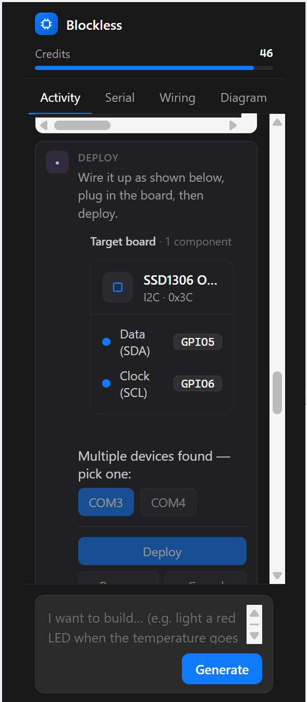

# Pitch Deck — US Edition v1

> Date: June 2026
> Audience: Pre-seed investors / pitch judges / maker-education partners
> Positioning: AI-native hardware creation on-ramp · US makerspaces & universities × near-shore kit fulfillment
> Source: English/US translation of deck_cn.md v22, China-specific framing removed.

---

## Slide 1 — Cover

# Say it. Ship real hardware.

Software has Cursor and Lovable.

Hardware deserves the same low-floor creation surface: you describe the idea, and the system handles part selection, driver matching, code generation, dependency install, local flashing, and serial debugging — then connects the running project to modules and fulfillment.

---

## Slide 2 — The shift

### AI is taking over the digital world. The physical world is still hand-assembled.

| Digital world | What already changed |
|---|---|
| Writing code | From autocomplete to agents editing multiple files, running tasks, and fixing errors |
| Web / apps | From hand-coding pages to generating prototypes and full pages from a sentence |
| Images / video | From operating tools to generating assets from natural language |
| Hardware | Still part selection, wiring, library hunting, flashing, serial watching |

The next generation of creation tools shouldn't stop at the screen. For AI to truly reach the physical world, it has to turn ideas into running devices.

---

## Slide 3 — The pain

### Makers don't lack ideas — they get stuck on the path to running hardware.

- **Selection is hard:** ESP32 / Arduino / STM32, sensors, actuators, comms — too many choices.
- **Wiring is hard:** I2C / SPI / UART / ADC, voltage, pin muxing — one wrong step and nothing runs.
- **Drivers are hard:** docs scattered across GitHub, vendor PDFs, forums, and sample code — AI happily hallucinates APIs that don't exist.
- **Debugging is hard:** hardware errors aren't normal compile errors — serial logs, power, wiring, and firmware versions all tangled together.

Today's barrier isn't imagination. It's getting the thing to actually run.

---

## Slide 4 — Why AI hardware is harder

### A generic software agent fails on the bench, because it's missing three things.

| Gap | Symptom | Consequence |
|---|---|---|
| Real driver knowledge | MCUs, sensors, library versions, and firmware capabilities are deeply fragmented | The LLM hallucinates APIs and install steps |
| Local execution rights | Flashing, serial, and file upload need access to the user's computer and board | Pure web demos can't close the loop |
| Hardware state awareness | Modules don't announce "who I am, what I can do, where I'm wired" | AI guesses pins, protocols, and error causes |

The core isn't "make AI write some code." It's giving AI a hardware runtime that can read packages, connect to boards, see feedback, and identify modules.

---

## Slide 5 — Market & ecosystem evidence

### The hardware-creation ecosystem is big enough — and the toolchain keeps getting more complex.

- Arduino's 2024 Open Source Report: the Library Manager added **1,198** new contributed libraries in 2024, reaching **7,669** total.
- Arduino shipped **3 Arduino Lab for MicroPython** releases in 2024 — MicroPython is now in the mainstream maker toolchain.
- Schematik announced a **$4.6M pre-seed** in April 2026 — "AI-native hardware creation" is already capital-validated.
- Kickstarter Technology projects have drawn **$1.95B** in cumulative pledges — hardware has a proven commercialization channel.

The bigger the ecosystem and the more devices and libraries, the more newcomers need a single on-ramp that threads the whole chain together.

Public sources: Arduino Open Source Report 2024; Schematik announcement; Kickstarter Stats.

---

## Slide 6 — The real data flow behind one sentence

### "Build hardware from a sentence" isn't a chat box — it's a shippable engineering pipeline.

1. User states the need: a temp/humidity monitor that lights up and shows the value above a threshold.
2. System gets a hardware picture: bind the device, run an I2C scan, check off modules manually, or describe the hardware in plain language.
3. The agent matches capabilities: it figures out the needed `hardware_tags` — display, sensing, comms, actuators.
4. It links Package Intelligence: reading `package.json`, READMEs, driver context, dependencies, chip support, and firmware requirements.
5. It generates a MicroPython project: code, drivers, assets, and config files together.
6. It packages to `.mpk` and writes `MANIFEST.JSON` — downloadable, pushable to the device, editable online, saved as a draft, or published to the store.
7. The local IDE / VS Code extension calls `mpremote` — installing deps, uploading code, running, reading serial output, and auto-repairing.

The sentence is just the entrance. The real moat is everything behind it: hardware profiling, driver retrieval, app packaging, local execution, and feedback-driven repair.

---

## Slide 7 — The product, live

### From a sentence to a wired, deployable build — inside VS Code today.

- **Say it:** the prompt box takes plain English — *"light an LED when the temperature goes…"*
- **It picks the part:** SSD1306 OLED on I²C `0x3C` — a real component, not a hallucination.
- **It wires it:** SDA → `GPIO5`, SCL → `GPIO6`, auto-mapped.
- **It finds the board:** detects `COM3` / `COM4` → one-click **Deploy**.
- **Closed loop & metered:** credits, plus Serial / Wiring / Diagram tabs for live feedback.

No datasheet, no manual pin-mapping, no flashing toolchain. Speak → wire → deploy.

---

## Slide 8 — Tech stack overview

### We're not a chat box. We're an AI-native hardware development stack.

| Layer | Role | Key implementation |
|---|---|---|
| Agent / Skill | Decompose natural language into hardware tasks and steps | Project generation, error repair, Arduino/PDF driver conversion, test generation |
| Knowledge & packages | Let AI use real drivers instead of guessing | Package Intelligence, uPyPI/GraftSense, driver context, deps, chips/fw tags |
| Local execution | Let AI actually touch the board | Thonny plugin, VS Code extension, `mpremote run/exec/fs`, serial logs |
| App runtime | Make projects installable, upgradable, rollback-able | uPyOS 0.9.0, LVGL, D-Shell, `.mpk`, `MANIFEST.JSON` |
| Device profile | Let the system know real hardware capabilities | `device_fingerprint`, `device_profiles`, `hardware_tags`, module registry |
| Module delivery | Turn a solution from a demo into a kit | GraftSense sensor modules, GraftPort boards, Dev Kit, production SOP |

The value of the stack: turning AI from "the person who writes code" into "the operator who can deliver a hardware project."

---

## Slide 9 — Package Intelligence / IDE

### Package Intelligence solves "finding packages is hard and messy." The IDE plugin puts package management into the real workflow.

- uPyPI + GraftSense + curated recipes index **200+ MicroPython packages/drivers**, covering sensor drivers, comms modules, and human-machine interaction.
- Package details carry machine-readable info: name, version, description, author, license, chip support, firmware deps, file lists.
- The Thonny plugin supports in-IDE search, metadata view, and download caching, and installs to the board's `/lib` via `mpremote`.
- The plugin handles multi-file packages, dependencies, network failures, unconfigured `mpremote`, and disconnected boards.

Our AI doesn't invent drivers — it calls a structured, installable, verifiable MicroPython package ecosystem.

---

## Slide 10 — The local execution loop

### MicroPython + mpremote is better suited to AI's trial-and-error loop.

| Loop step | Traditional Arduino / C path | Our MicroPython path |
|---|---|---|
| Write code | `.ino` implicit rules, multi-file stitching, complex C/C++ deps | Python is clean-structured — easier for AI to generate and fix |
| Install deps | Manual lib hunting, copy-paste, version conflicts | Package search + in-IDE install + automatic dep handling |
| Run feedback | Compile, flash, serial monitor scattered; each change means a wait | `mpremote run/exec/fs` — upload, run, read logs in one chain |
| Auto-repair | User reads serial and docs themselves | Agent reads error output, edits code, re-runs, re-verifies |

The key difference in hardware AI isn't "generating the first version." It's pulling device feedback into the agent loop.

---

## Slide 11 — uPyOS / uPyStore architecture

### We turn one-off code into installable, recommendable, distributable apps on the MCU.

| Component | Design | Value |
|---|---|---|
| uPyOS 0.9.0 | MicroPython + LVGL, running on ESP32 / ESP32-S3 | Gives MCUs a desktop launcher, app install/uninstall, settings, WiFi management |
| D-Shell | A hardware terminal device running uPyOS | Like an Android phone — the primary host for uPyOS |
| `.mpk` | A uPyOS app install package — a fixed-structure archive | Like an APK — hardware apps can install, update, distribute |
| `MANIFEST.JSON` | Declares app name, version, entry, publisher | Like an Android manifest — apps are recognizable to the system |
| `app_index.json` | The device-side store entry file, with a stable field structure | Shipped devices rely on it to pull the app index — compatibility can't break |

V2 goes further: `device_fingerprint` for anonymous device ID, `device_profiles` to store hardware pictures, `hardware_tags` to declare app deps, and a module registry recording chips, interfaces, capabilities, linked package candidates, and BLE broadcast info.

---

## Slide 12 — Competitive landscape & roadmap difference

### The race is validated. Nobody has locked in who can actually run real devices.

| Dimension | Schematik / web-class AI hardware tools | Us |
|---|---|---|
| Output | Code, wiring diagrams, BOM, tutorials | Runnable MicroPython project + module combo + local flash & debug |
| Driver source | Model-generated or public samples | Package Intelligence, real packages, README, `package.json`, driver context |
| Execution loop | Mostly stops at generation and explanation | `mpremote` connects the board, reads serial, auto-repairs |
| Hardware abstraction | AI picks components and pins | Active modules self-describe; the system reads capability, then generates |
| Delivery path | User still buys, solders, debugs | Modules, kits, and small-batch production SOP plug into fulfillment |

Our bet: AI hardware needs not just a "design tool," but a runtime, a module ecosystem, and a delivery chain.

---

## Slide 13 — Distribution: makerspaces, universities, fulfillment

### The on-ramp lands where American makers already are.

| Channel | What it gives us | Why it lands |
|---|---|---|
| FabLab / makerspace network | FabLab began at MIT's Center for Bits and Atoms — a global maker-education and digital-fabrication network with deep US roots | A ready-made distribution surface: curriculum, technical docs, projects, community |
| University courses & hackathons | ECE/CS programs, capstones, and hackathons need a fast idea→running-device path | "Build hardware from a sentence" drops straight into coursework, labs, and competitions |
| Maker community & creators | Hackster, Adafruit/SparkFun ecosystem, indie hardware creators | Organic top-of-funnel for both the tool and the kits |
| Domestic / near-shore fulfillment | ESP32, sensor modules, PCB/SMT, fast small-batch turnaround | Makerspaces and universities validate prototypes; fulfillment turns them into kits and products |

Makerspaces and universities do education and prototype validation; fulfillment turns validated designs into kits and products.

---

## Slide 14 — GraftSense / Port / Dev Kit delivery

### We don't just have a software stack — we have modules, boards, kits, and a small-batch production SOP.

| Delivery layer | Specifics | Capability it shows |
|---|---|---|
| GraftSense | A sensor module line, hardware design spec based on Grove; an RCWL-9623 ultrasonic transceiver module template is done | A real module product line, not just software demos |
| GraftPort | Expansion-board design spec, cost and sourcing sheet | Standardizes multiple modules onto boards and into teaching scenarios |
| Dev Kit | GraftSense/Port Dev Kit boxes, cost/sourcing table, pricing table, flyer | Packaged delivery for education, competitions, and courses |
| Production SOP | Design, validation, drivers, docs, small-batch production, product page, promotion, schedule | A process from prototype to product page and small-batch production |

The business loop isn't "sell an AI app": the IDE/Skill generates the project, uPyStore distributes the app, and GraftSense/Port/Dev Kit make the project buyable, assemblable, and deliverable.

---

## Slide 15 — Vision

### Every smart device, soon, can be spoken into existence.

We're not building another code generator. We're building the next-generation on-ramp for hardware creation:

- AI understands intent and decomposes ideas into hardware tasks.
- Package Intelligence and uPyOS provide a searchable, installable, reusable software ecosystem.
- Active modules let hardware be recognized by the system instead of blind-guessed by AI.
- The local IDE and `mpremote` let the agent actually run, read feedback, and auto-repair.
- A maker + fulfillment channel turns demos into kits, courses, and small-batch products.

In one sentence: from idea to hardware that runs, reuses, and ships.
