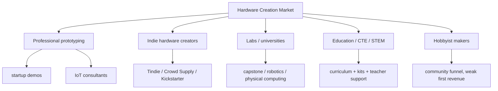

# Blockless Market Logic - Working Notes

> Date: 2026-06-06  
> Status: working notes, not final report.  
> Purpose: record the findings and logic before rewriting slides 9-12.  
> Rule: a market datum is useful only if it connects to Blockless buyer, budget, workflow, or distribution.

## 1. Current Critique

The current deck direction is better than the older version, but slides 9-12 are still too shallow.

The weak pattern:

```text
Adafruit has orders
Hackster has members
Kickstarter has projects
therefore Blockless has a market
```

That does not work. It only proves a broad hardware-creator ecosystem exists. It does not prove:

- who specifically buys Blockless,
- what budget they use,
- why they buy software instead of just modules,
- how channel traffic converts into paid usage,
- whether this can become venture-scale.

The stronger pattern must be:

```text
existing paid behavior -> painful workflow -> narrower buyer segment -> first channel -> conversion test -> expansion path
```

## 2. Uber-Style Market Logic To Emulate

The useful lesson from Uber-style seed logic is not "copy Uber's slides." It is the structure:

1. Start from an existing paid behavior, not an abstract TAM.
2. Pick an initial wedge where the pain is acute.
3. Show why the product is better on that exact workflow.
4. Use a bottom-up path from initial usage to expansion.
5. Make the first city / first segment feel small enough to win and large enough to matter.

For Uber, the initial behavior was not "everyone moves around." It was paid black-car / taxi-like urban rides, with a city-by-city entry path.

For Blockless, the initial behavior cannot be "everyone wants to build hardware." It has to be one or more existing paid behaviors:

- engineers and consultants spending paid time on embedded prototyping,
- makers buying modules/kits to complete projects,
- hardware creators launching products on Tindie / Crowd Supply / Kickstarter,
- labs and courses buying hardware kits and support,
- companies paying for faster demo and validation cycles.

## 3. Candidate Market Definition

Bad market definition:

```text
AI hardware creation for all makers and students.
```

Better market definition:

```text
AI-assisted embedded prototyping workflow for people who repeatedly turn sensors,
actuators, boards, and drivers into running demos.
```

This market is not identical to:

- PCB / EDA automation,
- K-12 STEM education,
- hobbyist module retail,
- consumer AI hardware,
- general IoT.

It overlaps with all of them, but the first wedge is the **prototype-to-running-device workflow**.

## 4. Evidence Buckets Found So Far

### 4.1 Embedded Creator Graph

These prove that a large embedded creator graph exists, not that Blockless has revenue yet.

| Evidence | What It Supports | What It Does Not Prove | Source |
|---|---|---|---|
| Arduino Pro says Arduino has 30M+ users and thousands of companies. | Embedded creation has a large user base that includes companies. | Does not prove they will pay for Blockless. | https://www.arduino.cc/pro/why-pro |
| Arduino 2024 open-source report says 1,198 new libraries entered Library Manager, +18% YoY. | Library/package sprawl is real; package intelligence is a valid pain area. | Does not prove MicroPython package intelligence alone is enough. | https://blog.arduino.cc/2025/02/19/the-2024-arduino-open-source-report-is-here/ |
| MicroPython is officially Python 3 optimized for microcontrollers and constrained environments. | MicroPython is a legitimate embedded stack, not a toy invented by us. | Does not prove it replaces C for production embedded. | https://micropython.org/ |

Insight:

Blockless should not argue "there are many Arduino users, so we win." The better insight is: as hardware libraries grow, LLMs become less reliable unless generation is grounded in real package metadata and driver contexts.

### 4.2 Module Retail / Maker Commerce

These prove that people buy electronics modules and kits repeatedly.

| Evidence | What It Supports | What It Does Not Prove | Source |
|---|---|---|---|
| Adafruit media kit reports 3M+ monthly uniques, 8M+ pageviews/month, 16.2K orders/month, 3,590+ products, 2K+ open-source repos. | There is a real commerce/content channel for electronics buyers. | Does not prove software conversion or subscription willingness. | https://cdn-shop.adafruit.com/files/media.pdf |
| SparkFun Qwiic, Adafruit STEMMA, Seeed Grove, DFRobot Gravity show plug-and-play modular electronics are mainstream. | Modularity is a proven behavior. Users already accept connectorized modules. | Does not prove our modules are defensible by themselves. | https://www.sparkfun.com/qwiic, https://www.adafruit.com/stemma, https://wiki.seeedstudio.com/Grove_System/, https://www.dfrobot.com/gravity |
| Tindie reports 489K+ orders shipped and 19.9K+ products. | Long-tail indie hardware commerce exists. | Does not prove Tindie sellers will buy AI tooling. | https://www.tindie.com/about/ |

Insight:

Adafruit/SparkFun/Seeed/DFRobot already solved "can people buy modules?" The unsolved layer is "can a user go from module purchase to working firmware without browsing docs, guessing drivers, and debugging pins?" Blockless must attach to the moment after purchase or before project start.

### 4.3 Hardware Launch / Creator Commercialization

These prove that some hardware creators move from prototype to product.

| Evidence | What It Supports | What It Does Not Prove | Source |
|---|---|---|---|
| Kickstarter Technology has $1.95B pledged and 59K+ launched projects. | Hardware/software creators use public launch channels. | Does not prove campaign success or margin for Blockless. | https://www.kickstarter.com/help/stats |
| Kickstarter Technology success rate is about 25%. | Many projects fail; tooling/support could matter. | Does not prove technical prototyping is the reason for failure. | https://www.kickstarter.com/help/stats |
| Crowd Supply positions itself as curated hardware crowdfunding/incubation and claims 90%+ launched-project funding success. | Serious hardware creators need more than generic crowdfunding; curation/support matters. | Does not prove Blockless can access these creators. | https://www.crowdsupply.com/apply |

Insight:

Kickstarter numbers are weak if used as TAM. They become useful only if tied to a narrower user: "creators trying to turn a connected prototype into a launchable kit/product." Crowd Supply may be a better analog than Kickstarter because it is closer to serious electronics creators.

### 4.4 Education / Lab Budgets

These prove potential budget pools, but procurement is slow.

| Evidence | What It Supports | What It Does Not Prove | Source |
|---|---|---|---|
| US CTE has 11.2M students. | There is a large technical education base. | Does not prove software-first adoption. | https://careertech.org/our-vision/cte-in-your-state/ |
| US Department of Education FY2024 reporting cites about $1.3B Perkins V investment. | CTE has real funding streams. | Does not prove accessible early-stage startup revenue. | https://www.ed.gov/media/document/fy24-afr-108470.pdf |
| China MOE 2024 reports 470K schools, 286.5M students, and 18.85M full-time teachers. | China education scale is huge. | Does not prove procurement or budget fit. | https://www.moe.gov.cn/jyb_sjzl/sjzl_fztjgb/202506/t20250611_1193760.html |
| China has policy tailwinds around AI education and selected 184 primary/secondary AI education bases. | AI education is strategically relevant in China. | Does not prove immediate hardware-agent procurement. | https://en.moe.gov.cn/news/press_releases/202412/t20241210_1166454.html, https://english.www.gov.cn/news/202402/23/content_WS65d85f47c6d0868f4e8e44a7.html |

Insight:

Education is a good expansion market, not the clean first-market story for a US VC deck. For China, education can be first landing only if framed as "course + kit + service" through labs/FabLabs/innovation courses, not broad public-school SaaS.

### 4.5 China Supply Chain / Module Ecosystem

These prove China can support rapid hardware iteration and kit delivery.

| Evidence | What It Supports | What It Does Not Prove | Source |
|---|---|---|---|
| Seeed says it helps productize prototypes from 1 to 1,000 pcs using engineering, supply-chain management, and agile manufacturing. | China/Shenzhen is credible for small-batch hardware transition. | Does not prove Blockless has Seeed partnership. | https://wiki.seeedstudio.com/About/ |
| DFRobot reports 2,000+ products, 100+ distributors, 200+ countries/areas. | Modular education/maker hardware is a real China-origin ecosystem. | Does not prove Blockless can beat DFRobot in modules. | https://www.dfrobot.com/about-us |
| M5Stack reports 3M+ products sold, 400+ SKUs, 181K+ community. | MicroPython/blockly/modular IoT has existing adoption. | Does not prove Blockless can compete on hardware ecosystem alone. | https://m5stack.com/about-us |
| China electronic information manufacturing revenue was RMB 16.19T in 2024. | Manufacturing depth is real. | Too broad for sales proof. | https://english.www.gov.cn/archive/statistics/202502/07/content_WS67a545b2c6d0868f4e8ef6c9.html |

Insight:

China should be used as an execution advantage:

- fast module iteration,
- low-cost kit assembly,
- university/lab pilots,
- course/service bundling,
- small-batch manufacturing path.

It should not be used as "China market is huge, therefore revenue."

### 4.6 Competitor / Capital Validation

These prove the category is fundable and crowded.

| Evidence | What It Supports | What It Does Not Prove | Source |
|---|---|---|---|
| Schematik raised $4.6M pre-seed in April 2026. | "AI for hardware creation" is fundable at seed/pre-seed. | Does not prove our wedge wins. | https://www.schematik.io/blog/schematik-raises-4-6m-pre-seed |
| Flux announced $37M new funding in February 2026. | AI-native hardware design has large investor interest. | Flux is closer to EDA/PCB, not our exact wedge. | https://www.flux.ai/p/blog/we-raised-37m-to-take-the-hard-out-of-hardware |
| JITX raised $12M Series A; Celus raised EUR25M Series A. | Electronics automation has venture-backed comps. | They are more professional EDA/BOM/layout oriented. | https://www.jitx.com/blog/series-a-announcement, https://7288952.fs1.hubspotusercontent-eu1.net/hubfs/7288952/Press_Release_Series_A_ENG.pdf |

Insight:

The deck should not claim "no competitors." It should say:

```text
AI hardware tooling is now a validated category.
Most funded players start from PCB/EDA or generic prompt-to-instructions.
Blockless starts from the runtime execution loop: package-grounded firmware on real modular hardware.
```

## 5. The Market Map We Need To Build

The final report should not be a list of facts. It should map the market into layers:


Another useful market segmentation:



## 6. Initial Buyer Hypotheses

### Buyer 1: IoT / embedded consultant

- Budget: professional tooling, project delivery, client work.
- Pain: repeated board bring-up and driver discovery.
- Why Blockless: saves hours per project and creates reusable recipes.
- Sales motion: paid pilot, team subscription, private package contexts.

### Buyer 2: hardware startup / product studio

- Budget: prototyping, engineering tools, founder demo velocity.
- Pain: investor/customer demo needs to work quickly.
- Why Blockless: compress idea-to-demo and reduces fragile firmware work.
- Sales motion: founder-led design partner -> paid project -> team plan.

### Buyer 3: maker-pro / indie hardware seller

- Budget: launch prep, kits, documentation, support reduction.
- Pain: turning a prototype into a reproducible recipe/product.
- Why Blockless: generates working firmware and supportable project packages.
- Sales motion: recipe -> kit preorder -> agent subscription or per-project fee.

### Buyer 4: university lab / capstone course

- Budget: lab equipment, course tooling, research project support.
- Pain: repeated student hardware setup and debugging.
- Why Blockless: reduces teaching/debugging overhead.
- Sales motion: lab pilot -> semester license + kits.

### Buyer 5: China innovation education / FabLab / competition training

- Budget: course package, kit package, workshop/training.
- Pain: need complete hardware projects that can run in class.
- Why Blockless: combines agent, kit, driver packages, and support.
- Sales motion: workshop -> course kit -> annual service.

## 7. What Is Still Missing

High-priority missing facts:

1. Number of accessible embedded consultants / IoT agencies in US.
2. Better data on Crowd Supply / Tindie creator economics.
3. Better data on university capstone / makerspace hardware budgets.
4. China university / innovation education procurement examples.
5. Real pricing benchmarks for developer tools vs hardware education kits.
6. Evidence of paid AI coding tool adoption among hardware/embedded developers.
7. Interviews: at least 20 real users, as defined in the commercial feasibility appendix.

## 8. Provisional Slide 9-12 Logic

If turning this into slides later, the order should be:

### Slide 9: The Existing Creation Graph

Show that hardware creation already has:

- buyers of modules,
- creators publishing projects,
- indie sellers,
- labs/courses,
- launch platforms.

But do not call this revenue.

### Slide 10: The Workflow Bottleneck

Show the repeated workflow:

```text
idea -> module choice -> driver search -> wiring -> firmware -> flash -> serial logs -> fix
```

Point out Blockless attaches to the center of that workflow.

### Slide 11: Beachhead Buyers

Rank by willingness to pay:

1. consultants,
2. startups/product studios,
3. maker-pros,
4. labs/capstones,
5. education after course packaging.

### Slide 12: Sales Experiment

Use milestones, not TAM:

- 20 design partners,
- 10 verified recipes,
- 5 paid pilots,
- 100 kit preorders,
- 50 active hardware runs.

## 9. Current Bottom Line

The story can work if the market argument is:

```text
There is a large existing hardware creation graph.
The highest-value repeated pain is embedded prototype execution.
Blockless starts with users who already pay in time, tools, or kits.
The first sales path is paid pilots + verified recipes + starter kits.
The long-term moat is the accumulated package/board/module truth from hardware runs.
```

The story is weak if the market argument is:

```text
Adafruit has orders, Hackster has users, students are many, therefore Blockless has a huge market.
```

