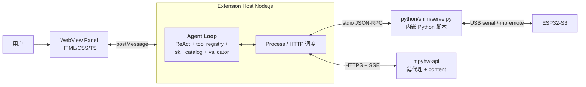

# 03 — mpyhw-vscode Spec

> 仓库：`mpyhw-vscode`（VS Code Extension + 内嵌 Python shim + **agent loop**）
> 适用版本：v0.2.0
> 读者：客户端开发（TS + 内嵌 Python shim）；建议先读 [`00-architecture-overview.md`](00-architecture-overview.md)

---

## 1. 扩展定位

- 名称：`mpyhw-vscode`
- VS Code Marketplace：`mpyhw.mpyhw-vscode`（发布者 `mpyhw`）
- 语言：TypeScript（主）+ Python（内嵌 `python/shim/` 子目录，约 400 行）
- **自包含的 IDE 客户端**：UI + **agent loop** + 本地 hardware shim + 后端 LLM 代理通信
- 最低 VS Code 版本：1.85
- 首发平台：Windows + macOS（Linux 在 v0.3）

**关键设计原则**（V3 区别于 V2 的关键）：
- **Agent loop（ReAct / tool dispatch / skill catalog / manifest validator）跑在 TS 端**——对齐 Cursor / Claude Code / Cline / Continue / Aider
- 业务逻辑既不在后端，也不在 shim；客户端 TS 是 brain
- `mpyhw-api` 退化为 LLM 代理 + content fetch + quota
- 内嵌 `python/shim/` 子目录只做：mpremote + pyserial 的 IO 包装，无任何 LLM / manifest / agent 逻辑

---

## 2. 架构概览



### 2.1 进程模型

| 进程 | 语言 | 职责 |
|---|---|---|
| **Extension Host** | TS | 注册 commands、管理生命周期、**跑 agent loop**、HTTPS 调后端 SSE、spawn shim 调度本地 IO |
| **WebView Panel** | HTML/TS | 渲染 UI；用 `postMessage` 与 Extension Host 通信 |
| **Python shim subprocess** | Python | 跑 `python/shim/serve.py`，只暴露 **7 个 IO RPC method**（V3.1.2 加 install_package） |

### 2.2 数据流总览

- **WebView ↔ Ext**：postMessage（UI 事件 + agent state 推送）
- **Ext ↔ api**：HTTPS，三类调用
  - `POST /v1/llm/messages`（SSE 长流，主要数据通道）
  - `GET /v1/skills` / `GET /v1/boards` / `GET /v1/tools` / `GET /v1/packages/index`（启动时拉缓存，之后偶尔重拉）
  - `/v1/packages/*`（agent loop 中 package tool dispatch 时调）
  - `POST /v1/telemetry`（trace event 推送）
- **Ext ↔ shim**：stdio JSON-RPC 2.0，7 个 IO method
- **shim ↔ 板子**：mpremote subprocess + pyserial

---

## 3. WebView UI 组件

### 3.1 总体布局（Activity Bar 侧边栏，可拉宽）

```
┌─────────────────────────────────────────┐
│  mpyhw — AI 一句话生硬件                 │
├─────────────────────────────────────────┤
│ ┌─────────────────────────────────────┐ │
│ │ 设备：[ESP32-S3 (COM3) ▾]           │ │  ← device picker
│ │ 配额：今日剩余 4 个 session         │ │
│ └─────────────────────────────────────┘ │
│                                         │
│ ┌─────────────────────────────────────┐ │
│ │ 你想做什么？                        │ │
│ │ ┌───────────────────────────────┐  │ │
│ │ │ 超过 30 度亮红灯              │  │ │
│ │ └───────────────────────────────┘  │ │
│ │              [开始生成] [中止]      │ │
│ └─────────────────────────────────────┘ │
│                                         │
│ ┌─ 当前进度 ─────────────────────────┐ │
│ │ 💭 我先查板子配置...                │ │  ← thinking 流式
│ │ 🔧 query_board_profile (local) ✓   │ │
│ │ 🔧 search_packages (api-proxy) ✓   │ │
│ │ 📖 loaded skill: manifest-resolu.. │ │
│ │ ❓ 请问温湿度传感器接哪个 pin？...   │ │
│ └─────────────────────────────────────┘ │
│                                         │
│ ┌─ 代码预览 ────────────── [diff] ───┐ │
│ │ from machine import Pin, I2C       │ │  ← monaco editor
│ │ ...                                │ │
│ └─────────────────────────────────────┘ │
│                                         │
│ ┌─ 串口输出 ────────────────────────┐ │
│ │ MPYHW_READY                        │ │  ← xterm.js
│ │ TEMP_C=28.3 LED=OFF                │ │
│ │ TEMP_C=31.2 LED=ON                 │ │
│ └─────────────────────────────────────┘ │
│                                         │
│ [▾] 开发者模式：agent trace             │
└─────────────────────────────────────────┘
```

### 3.2 组件清单

| 组件 | 用什么 | 行数预算 |
|---|---|---|
| Input textarea | `<vscode-textarea>`（vscode-elements） | 50 |
| Submit button + 状态 | `<vscode-button>` | 30 |
| Device picker | VS Code `vscode.window.showQuickPick`（不在 WebView，在 Extension Host） | 80 |
| Turn 流（thinking 流式 / tool / skill load 渲染） | 自实现 list 渲染 + token-by-token 追加 | 150 |
| 代码 diff | `monaco-editor` 嵌入 WebView | 150 |
| 串口流 | `xterm.js` 嵌入 WebView | 100 |
| Agent trace 抽屉 | `<vscode-collapsible>` 内放 JSON viewer | 100 |
| 配额显示 | 每 30 秒拉一次 `GET /v1/quota` | 50 |
| Confirm 对话框（shim IO tool requires_user_confirm） | `vscode.window.showInformationMessage` | 40 |
| Ask-user 对话框（agent 发起的 ask_user） | WebView 内嵌问答组件 | 80 |

总 WebView UI TS/HTML 行数预算：约 **2200 行**。

---

## 4. Python 环境管理（Codex 强调的薄弱点）

### 4.1 Python interpreter 发现

Windows 上 Python 来源混乱（Microsoft Store / Anaconda / python.org / WSL）。扩展首次激活时按优先级探测：

```typescript
async function findPython(): Promise<string | null> {
  // 0. 用户 settings 覆盖（最高优先级）
  const userPath = config.get<string>("mpyhw.pythonPath");
  if (userPath && await isPython310Plus(userPath)) return userPath;

  // 1. VS Code Python Extension 选中的 interpreter（如果用户装了）
  const pyExt = vscode.extensions.getExtension("ms-python.python");
  if (pyExt?.exports?.environments?.getActiveEnvironmentPath) {
    const p = await pyExt.exports.environments.getActiveEnvironmentPath();
    if (p && await isPython310Plus(p.path)) return p.path;
  }

  // 2. PATH 上 python3 / python
  for (const name of ["python3", "python"]) {
    const path = await which(name);
    if (path && await isPython310Plus(path)) return path;
  }

  // 3. 平台特定常见位置
  const candidates = process.platform === "win32"
    ? ["C:\\Python310\\python.exe", "C:\\Python311\\python.exe",
       "C:\\Python312\\python.exe", "C:\\Python313\\python.exe",
       `${os.homedir()}\\AppData\\Local\\Programs\\Python\\Python311\\python.exe`]
    : ["/usr/local/bin/python3", "/opt/homebrew/bin/python3"];
  for (const c of candidates) {
    if (await fs.exists(c) && await isPython310Plus(c)) return c;
  }

  return null;
}
```

行数预算：~100 行。

### 4.2 Isolated venv 创建

发现 Python 后，扩展在 `~/.mpyhw/venv/` 创建 isolated venv：

```typescript
async function ensureVenv(python: string): Promise<string> {
  const venvDir = path.join(os.homedir(), ".mpyhw", "venv");
  const venvPython = process.platform === "win32"
    ? path.join(venvDir, "Scripts", "python.exe")
    : path.join(venvDir, "bin", "python");

  if (await fs.exists(venvPython)) {
    if (await hasPackage(venvPython, "mpremote")) return venvPython;
  } else {
    await execFile(python, ["-m", "venv", venvDir]);
  }

  const reqPath = path.join(extensionPath, "python", "shim", "requirements.txt");
  await execFile(venvPython, ["-m", "pip", "install", "--upgrade", "-r", reqPath]);

  return venvPython;
}
```

行数预算：~80 行。

### 4.3 Shim subprocess 生命周期

```typescript
class ShimProcess {
  private child: ChildProcess | null = null;

  async ensureRunning(): Promise<void> {
    if (this.child && !this.child.killed) return;
    const python = await findPython();
    if (!python) throw new PythonNotFoundError();
    const venvPython = await ensureVenv(python);
    const shimScript = path.join(extensionPath, "python", "shim", "serve.py");
    this.child = spawn(venvPython, [shimScript, "--rpc-stdio"], {
      stdio: ["pipe", "pipe", "pipe"],
    });
    this.child.on("exit", (code) => this.handleCrash(code));
  }

  async call(method: string, args: object): Promise<object> {
    await this.ensureRunning();
    // JSON-RPC 2.0 over stdio
    // ...
  }
}
```

### 4.4 错误处理

| 错误 | UI 提示 + 行动 |
|---|---|
| Python 没装 | 弹窗 "需要 Python 3.10+。打开下载页？" → 链接 python.org |
| Python 版本 < 3.10 | 弹窗 + 指引；让用户在 settings 指定别的 python |
| 找不到 python（多 interpreter 选错） | 弹窗 "请在 settings 指定 `mpyhw.pythonPath`" + 链接到 VS Code Python Extension |
| venv 创建失败 | 弹窗 + 显示 stderr |
| pip install 失败（GFW / 代理） | 弹窗指引设置 pip 镜像源（清华 / 阿里），`mpyhw.pipIndexUrl` settings |
| Shim subprocess 崩溃 | 弹窗 "Shim 崩溃，已重启。错误已上报。" + Sentry 上报 + 自动重启一次 |
| stdio 通信断 | 同上 |
| 后端 HTTPS 调用失败 | 弹窗 "无法连接 mpyhw-api。检查网络或 BYOK 设置。" |
| SSE 流中断（mid-stream） | 保留已收 messages；UI 提示"网络中断，[重试] 继续 / [中止]"；用户点重试 → ext 用现有 messages 重发 `/v1/llm/messages` |
| **串口被外部占用**（Thonny / 另一 VS Code 窗口 / 手动 mpremote） | 启动时检测 `~/.mpyhw/locks/{port}.lock` 文件锁状态 + PID 活检；占用 → 弹窗"检测到 {占用进程} 正在使用 {port}。请关闭后重试。"；详 §4-bis.4 |
| **Git 仓库脏**（用户外部改文件未 commit）| 扩展激活时 `git status`；有未提交改动 → 弹窗"检测到未提交改动。是否在生成新代码前先 commit？" → 走自动 commit flow（详 §5-tris） |

### 4.5 生命周期

- 扩展首次激活：lazy 启动 shim subprocess（直到用户打开 panel 才启）
- VS Code 关闭：subprocess 收 SIGTERM → 优雅退出（最多 5 秒强 kill）

---

## 4-bis. Hardware Shim（内嵌 Python 子项目）

### 4-bis.1 目录结构

```
mpyhw-vscode/
  src/                    # TypeScript 源码
    agent/                # ← V3 新增：agent loop TS 实现
      loop.ts
      tool_registry.ts
      skill_catalog.ts
      package_catalog.ts
      manifest_validator.ts
      safety_audit.ts
      context_builder.ts
      sse_client.ts
    ui/                   # WebView 渲染
    services/             # ShimProcess / ApiClient / VenvManager
  python/
    shim/
      serve.py            # JSON-RPC stdio entry point（~80 行）
      mpremote_runner.py  # mpremote subprocess 包装（~150 行）
      serial_reader.py    # pyserial 读串口（~100 行）
      device_scan.py      # 扫串口找已知 board（~50 行）
      health_check.py     # 自诊断（~80 行）
      requirements.txt    # mpremote==1.23.0, pyserial==3.5
  resources/
    skills/foundational/  # 打包的 Foundational skill markdown
      agent_identity.md
      safety_boundaries.md
      tool_use_protocol.md
    canonical_tools.json  # 打包的 canonical tool registry
  package.json
  README.md
```

总 Python shim 行数预算：约 **480 行**（V3 基础 400 + install_package 处理 ~50 + per-port lock 管理 ~30）。

### 4-bis.2 7 个 RPC method 的 schema

#### `device.scan`
```python
# args: {}
# returns: {"status": "ok", "devices": [{"port": "COM3", "vid": "0x303A",
#           "pid": "0x1001", "board_match": "esp32-s3-devkitc-1"}]}
```

#### `device.flash_and_run`
```python
# args: {"code": "<main.py content>", "port": "COM3", "timeout_sec": 10}
# returns: {"status": "ok", "stdout": "...", "stderr": "", "duration_ms": 5230}
# or:      {"status": "error", "error_kind": "DeviceDisconnected", "message": "..."}
```

#### `device.write_main_py`
```python
# args: {"code": "<main.py content>", "port": "COM3"}
# returns: {"status": "ok"}
# 内部命令: mpremote <port> resume fs cp main.py :main.py
# 注意: resume flag 必须，否则每次 cp 触发软重置打断程序
```

#### `device.install_package` （V3.1.2 新增，第 7 个 RPC）
```python
# args: {"url": "https://upypi.net/pkgs/aht20_driver/1.0.0/package.json",
#        "port": "COM3", "timeout_sec": 60}
# returns: {"status": "ok", "stdout": "...", "stderr": "", "duration_ms": 4520}
# or:      {"status": "error", "error_kind": "package_not_found" | "incompatible_chip" | "network" | "port_busy" | "mpremote_error", ...}
#
# 内部步骤:
#   1. 拿 per-port lock + 文件锁 ~/.mpyhw/locks/{port}.lock
#   2. mpremote <port> resume fs mkdir :/lib   (idempotent: 已存在不报错)
#   3. mpremote <port> resume mip install <url>  (官方实现自动递归 deps)
#   4. 释放锁
# 失败时 error_kind 解析自 mpremote stderr 关键词
# (chip mismatch / connection refused / port busy)
```

#### `device.serial_read_until`
```python
# args: {"port": "COM3", "pattern": "LED=", "timeout_sec": 8}
# returns: {"status": "ok", "lines": ["MPYHW_READY", "TEMP_C=28.4 LED=OFF"]}
# or:      {"status": "timeout", "tail": "..."}
```

#### `device.list_files`
```python
# args: {"port": "COM3"}
# returns: {"status": "ok", "files": ["main.py", "lib/aht20.py", "boot.py"]}
```

#### `device.health_check`
```python
# args: {}
# returns: {
#   "status": "ok",
#   "python_version": "3.11.5",
#   "venv_path": "/Users/.../.mpyhw/venv",
#   "mpremote_version": "1.23.0",
#   "pyserial_version": "3.5",
#   "devices_visible": [...],
#   "os": "win32",
#   "platform": "Windows-10..."
# }
```

### 4-bis.3 Shim **不**实现的

- 不做 intent 判断
- 不做 manifest validation
- 不做 banned API audit
- 不做 board profile 查询
- 不调任何后端 API
- 不缓存用户代码
- 不实现自己的串口协议（全靠 mpremote；mpremote 不够时降级到 pyserial 但保持 byte-level）

### 4-bis.4 Per-port Locking（V3.1.2 新增）

避免多 VS Code 窗口 / Thonny / 外部 mpremote 同时操作同一串口。

**双层锁**：

1. **Shim 内 asyncio Lock**（per-port，进程内）：
   ```python
   _port_locks: dict[str, asyncio.Lock] = {}
   def get_port_lock(port: str) -> asyncio.Lock:
       if port not in _port_locks:
           _port_locks[port] = asyncio.Lock()
       return _port_locks[port]
   ```
   每个 device.* method 入口 `async with get_port_lock(port):` 串行化同 port 调用。

2. **OS-level 文件锁**（跨进程，`~/.mpyhw/locks/{port_safe_name}.lock`）：
   - 用 `portalocker` 或 `fcntl`
   - Acquire 时写入 PID + timestamp
   - Stale lock cleanup：拿锁前检查 PID 是否还活着（`os.kill(pid, 0)`），死进程留下的锁强制释放
   - port_safe_name = port 替换 `/` 和 `\` 为 `_`（避免路径注入）

3. **外部占用检测**（无法 lock 但能报错）：
   - 锁拿到后尝试 `mpremote <port> resume exec "pass"` 失败 → 说明 Thonny 等外部进程占用 → 返回 `{status: "error", error_kind: "port_busy"}`

### 4-bis.5 验收语句（shim 独立可测）

- 板子未插：`device.scan` 返回 `{"status": "ok", "devices": []}`
- 板子插入：`device.scan` 含至少一个 dict，含 `port`、`vid`、`pid` 字段
- `device.flash_and_run` code="print('hello')" → returns `stdout` 含 `"hello"`
- `device.serial_read_until` pattern 不出现且 timeout 短 → returns `{"status": "timeout", "tail": "..."}`
- `device.health_check` 不依赖板子，永远返回 200 + python/mpremote 版本信息
- `device.install_package` url="https://upypi.net/pkgs/aht20_driver/1.0.0/package.json" port=COM3 → returns `status:"ok"` 且 device `/lib/aht20.py` 存在
- 同一 port 并发调 `device.flash_and_run` + `device.read_serial_until` → 第二个调用等第一个完成（lock 生效）
- 第二个 mpyhw-vscode 窗口拿同 port → 文件锁阻断 + 返回 `port_busy`
- Thonny 占用 port → `device.flash_and_run` 返回 `{status:"error", error_kind:"port_busy"}`
- 把任意非 7 个 method 传进去 → 返回 JSON-RPC error code -32601 (method not found)

---

## 5. Agent Loop（TS 实现，V3 核心新增章节）

### 5.1 模块清单

`src/agent/` 目录，约 **500 行 TypeScript**：

| 模块 | 职责 | 行数预算 |
|---|---|---|
| `loop.ts` | ReAct 主循环 + SSE 消费 + tool dispatch 调度 + repair counter + max_turns | 150 |
| `tool_registry.ts` | **14** 个 tool 的 handler 映射 + executor 分类（local / api-proxy / shim / ui-prompt）+ requires_user_confirm 配置 + **batch confirm 合并**（同一轮多个 install_package 合并对话框） | 130 |
| `skill_catalog.ts` | 启动时拉 `/v1/skills` 缓存到 workspace state；维护 `session.loadedSkills` set；提供 catalog 渲染 + skill body lookup | 80 |
| `package_catalog.ts` | 启动时拉 `/v1/packages/index` 摘要缓存到 workspace state；提供 package search/resolve/context API wrapper 和 support level 解释 | 80 |
| `manifest_validator.ts` | zod schema for `HardwareManifest` + 跑 pin 合法性 + **pin_capabilities 守门**（V3.1.2 Q5：拒绝不在 board profile capabilities map 里的 pin/role）+ 限流电阻校验 | 100 |
| `safety_audit.ts` | TS regex/简单 AST 扫 banned API（`machine.mem`、`socket.*`、`exec`、`eval`、`__import__`、`os.system` 等） | 50 |
| `context_builder.ts` | 组装 messages + system parts（Foundational bundled + board profile cached + package index summary + skill catalog + loaded skill bodies）+ 加 `cache_control: ephemeral` markers | 60 |
| `sse_client.ts` | 调 `POST /v1/llm/messages` + 消费 SSE 流 + 解析 event chunks + 抛 typed events 给 loop.ts | 80 |

总：约 **700 行**（含注释 +/- 10%）。

### 5.2 `loop.ts` 主循环伪代码

```typescript
async function runSession(intent: string, boardId: string,
                          onEvent: (e: AgentEvent) => void): Promise<SessionResult> {
  const session: SessionState = {
    traceId: uuid4(),
    intent,
    boardId,
    loadedSkills: new Set<string>(),  // 已 load 的 skill name
    turnSeq: 0,
    repairRound: 0,
    messages: [{ role: "user", content: intent }],
  };

  while (true) {
    session.turnSeq++;
    if (session.turnSeq > MAX_TURNS) {
      return { terminal: "max_turns" };
    }

    // 1. 组装 context
    const systemParts = contextBuilder.build(session, cachedBoardProfile, cachedPackageIndexSummary, cachedSkillCatalog);
    const tools = toolRegistry.toAnthropicSchemas();

    // 2. 开 SSE 流
    onEvent({ type: "turn_started", turnSeq: session.turnSeq });
    const stream = sseClient.postLlmMessages({
      sessionId: session.traceId,
      model: undefined,  // server 覆盖
      system: systemParts,
      messages: session.messages,
      tools,
      temperature: 0.1,
      max_tokens: 4096,
    });

    // 3. 消费流
    let assistantContent: ContentBlock[] = [];
    let firstTextBlock = "";
    let stopReason: string | null = null;

    for await (const event of stream) {
      switch (event.type) {
        case "content_block_start":
          assistantContent[event.index] = event.content_block;
          break;
        case "content_block_delta":
          if (event.delta.type === "text_delta") {
            assistantContent[event.index].text += event.delta.text;
            // 偷看第一个 text block 是否 not_hardware
            if (event.index === 0 && firstTextBlock.length < 50) {
              firstTextBlock += event.delta.text;
              if (firstTextBlock.startsWith("<not_hardware>")) {
                // 等 stream close 看到完整 reason 再处理
              }
            }
            onEvent({ type: "thinking_delta", text: event.delta.text });
          } else if (event.delta.type === "input_json_delta") {
            (assistantContent[event.index] as ToolUseBlock).input_partial += event.delta.partial_json;
          }
          break;
        case "message_delta":
          stopReason = event.delta.stop_reason;
          break;
        case "message_stop":
          break;
      }
    }

    // 4. 检 not_hardware
    if (session.turnSeq === 1 && firstTextBlock.startsWith("<not_hardware>")) {
      const match = firstTextBlock.match(/<not_hardware>(.*?)<\/not_hardware>/s);
      onEvent({ type: "not_hardware", reason: match?.[1] ?? "non-hardware intent" });
      return { terminal: "not_hardware" };
    }

    // 5. 加 assistant message 进历史
    session.messages.push({ role: "assistant", content: assistantContent });

    // 6. 看 stop_reason
    if (stopReason === "end_turn") {
      const finalText = assistantContent.filter(b => b.type === "text").map(b => b.text).join("\n");
      onEvent({ type: "final_answer", text: finalText });
      return { terminal: "success", finalAnswer: finalText };
    }

    // 7. stop_reason == "tool_use" → dispatch 所有 tool_use blocks
    const toolUseBlocks = assistantContent.filter(b => b.type === "tool_use") as ToolUseBlock[];
    const toolResults: ContentBlock[] = [];

    for (const tc of toolUseBlocks) {
      const exec = toolRegistry.getExecutor(tc.name);
      const requiresConfirm = toolRegistry.requiresConfirm(tc.name);

      if (requiresConfirm) {
        onEvent({ type: "confirm_needed", toolUseId: tc.id, name: tc.name, args: tc.input });
        const approved = await waitForUserConfirm(tc.id);
        if (!approved) {
          toolResults.push({ type: "tool_result", tool_use_id: tc.id,
                              content: JSON.stringify({ status: "user_declined" }) });
          continue;
        }
      }

      onEvent({ type: "tool_dispatch_started", toolUseId: tc.id, name: tc.name, executor: exec });
      let obs: object;
      try {
        switch (exec) {
          case "local":
            obs = await toolRegistry.dispatchLocal(tc.name, tc.input, session);
            break;
          case "api-proxy":
            obs = await toolRegistry.dispatchApiProxy(tc.name, tc.input);
            break;
          case "shim":
            obs = await shim.call(`device.${tc.name.replace(/^device_/, '')}`, tc.input);
            break;
          case "ui-prompt":
            obs = await emitUiPromptAndWait(tc.id, tc.input);
            break;
        }
      } catch (e) {
        obs = { status: "error", error_kind: e.constructor.name, message: e.message };
      }
      onEvent({ type: "tool_result", toolUseId: tc.id, observation: obs });
      toolResults.push({ type: "tool_result", tool_use_id: tc.id,
                          content: JSON.stringify(obs) });
    }

    // 8. 加 tool_result 进 messages，进入下一轮
    session.messages.push({ role: "user", content: toolResults });

    // 9. repair round 计数：若刚跑过 generate_code 然后 flash_and_run+read_serial_until 失败 → +1
    if (detectRepairCycle(session)) {
      session.repairRound++;
      if (session.repairRound > MAX_REPAIR_ROUND) {
        onEvent({ type: "repair_exhausted" });
        return { terminal: "repair_exhausted" };
      }
    }
  }
}
```

### 5.3 `tool_registry.ts` 关键结构

```typescript
type Executor = "local" | "api-proxy" | "shim" | "ui-prompt";

interface ToolDef {
  name: string;
  description: string;
  input_schema: object;       // JSON Schema for Anthropic
  executor: Executor;
  requires_user_confirm: boolean;
  handler?: (args: any, session: SessionState) => Promise<object>;   // 仅 local 用
  apiPath?: string;            // 仅 api-proxy 用
  shimMethod?: string;         // 仅 shim 用
}

const TOOLS: ToolDef[] = [
  {
    name: "query_board_profile",
    description: "...",
    input_schema: { /* ... */ },
    executor: "local",
    requires_user_confirm: false,
    handler: async (args, session) => {
      const profile = cachedBoardProfiles.get(args.board_id ?? session.boardId);
      return profile ? { status: "ok", profile } : { status: "error", error_kind: "unknown_board" };
    },
  },
  {
    name: "search_packages",
    description: "Search MicroPython package registry by keyword/capability/bus/board. Use before selecting concrete hardware drivers.",
    input_schema: { /* ... */ },
    executor: "api-proxy",
    requires_user_confirm: false,
    apiPath: "/v1/packages/search",
  },
  {
    name: "resolve_package_candidates",
    description: "Resolve package candidates from intent + capabilities + board, returning ranked choices and whether the user must choose.",
    input_schema: { /* intent, capabilities, board_id, constraints */ },
    executor: "api-proxy",
    requires_user_confirm: false,
    apiPath: "/v1/packages/resolve",
  },
  {
    name: "get_package_context",
    description: "Fetch machine-readable driver context for one package version before generating imports, constructors, reads, or install steps.",
    input_schema: { /* name, version */ },
    executor: "api-proxy",
    requires_user_confirm: false,
    apiPath: "/v1/packages/{name}/{version}/driver-context",
  },
  {
    name: "propose_manifest",
    description: "...",
    input_schema: { /* ... */ },
    executor: "local",
    requires_user_confirm: false,
    handler: async (args, session) => {
      return manifestValidator.validate(args.manifest, cachedBoardProfiles.get(session.boardId));
    },
  },
  {
    name: "generate_code",
    description: "...",
    input_schema: { /* ... */ },
    executor: "local",
    requires_user_confirm: false,
    handler: async (args, session) => {
      // 嵌套 SSE 子流
      const skillBody = await skillCatalog.fetchBody("code-generation-guide");
      const driverContexts = args.driver_contexts ?? session.resolvedDriverContexts;
      if (!driverContexts?.length) {
        return { status: "error", error_kind: "driver_context_missing" };
      }
      const subStream = sseClient.postLlmMessages({
        sessionId: session.traceId + "/sub-generate",
        system: [
          { type: "text", text: skillBody },
          { type: "text", text: boardProfileBrief(session.boardId) },
          { type: "text", text: `Driver contexts:\n${JSON.stringify(driverContexts)}` },
        ],
        messages: [{ role: "user",
                     // 明显硬件措辞 → 避免 intent gate self-reject（V3.1.2 Q6）
                     content: `Generate MicroPython main.py for ${session.boardId} with this manifest:\n${JSON.stringify(args.manifest)}` }],
        tools: [],  // 子流里不允许调 tool
        max_tokens: 4096,
      });
      const code = await consumeStreamToText(subStream);
      const audit = safetyAudit.audit(code, {
        boardProfile: cachedBoardProfile,
        driverContexts,
      });
      if (!audit.passed) {
        return { status: "error", error_kind: "banned_api", banned: audit.banned_calls };
      }
      return { status: "ok", code, audit };
    },
  },
  {
    name: "audit_code",
    description: "...",
    input_schema: { /* ... */ },
    executor: "local",
    requires_user_confirm: false,
    handler: async (args, session) => safetyAudit.audit(args.code, {
      boardProfile: cachedBoardProfile,
      driverContexts: args.driver_contexts ?? session.resolvedDriverContexts,
    }),
  },
  {
    name: "load_skill",
    description: "...",
    input_schema: { /* ... */ },
    executor: "local",
    requires_user_confirm: false,
    handler: async (args, session) => {
      if (session.loadedSkills.has(args.skill_name)) {
        return { status: "noop", already_loaded: true };
      }
      const exists = await skillCatalog.hasSkill(args.skill_name);
      if (!exists) return { status: "error", error_kind: "unknown_skill" };
      session.loadedSkills.add(args.skill_name);
      return { status: "ok", skill_name: args.skill_name, loaded: true };
    },
  },
  {
    name: "ask_user",
    description: "...",
    input_schema: { /* ... */ },
    executor: "ui-prompt",
    requires_user_confirm: false,
  },
  {
    name: "scan_device",
    description: "...",
    input_schema: { /* ... */ },
    executor: "shim",
    requires_user_confirm: false,
    shimMethod: "device.scan",
  },
  {
    name: "install_package",
    description: "Install a resolved MicroPython driver package onto the device /lib via mpremote mip install. Call this BEFORE flash_and_run if main.py imports the driver. Auto-recurses deps.",
    input_schema: { /* url, port */ },
    executor: "shim",
    requires_user_confirm: true,  // batch confirm: 多个连续 install_package 合并对话框
    shimMethod: "device.install_package",
  },
  {
    name: "flash_and_run",
    description: "...",
    input_schema: { /* ... */ },
    executor: "shim",
    requires_user_confirm: true,
    shimMethod: "device.flash_and_run",
  },
  {
    name: "write_main_py",
    description: "...",
    input_schema: { /* ... */ },
    executor: "shim",
    requires_user_confirm: true,
    shimMethod: "device.write_main_py",
  },
  {
    name: "read_serial_until",
    description: "...",
    input_schema: { /* ... */ },
    executor: "shim",
    requires_user_confirm: false,
    shimMethod: "device.serial_read_until",
  },
];
```

### 5.4 `skill_catalog.ts`：缓存 + 按需 fetch body

```typescript
class SkillCatalog {
  private indexVersion: string | null = null;
  private summaries: SkillSummary[] = [];
  private bodyCache = new Map<string, string>();  // name → body markdown

  async initialize(): Promise<void> {
    // 启动时拉 catalog（带 ETag）
    const cached = await workspaceState.get("mpyhw.skillCatalog");
    const headers = cached ? { "If-None-Match": cached.version } : {};
    const resp = await apiClient.get("/v1/skills", { headers });
    if (resp.status === 304) {
      this.indexVersion = cached.version;
      this.summaries = cached.summaries;
    } else {
      this.indexVersion = resp.body.version;
      this.summaries = [...resp.body.foundational, ...resp.body.task, ...resp.body.recovery];
      await workspaceState.update("mpyhw.skillCatalog", { version: this.indexVersion,
                                                             summaries: this.summaries });
    }
  }

  renderCatalog(): string {
    // 给 system prompt 用的渲染
    const lines: string[] = ["AVAILABLE SKILLS (call load_skill with skill_name when relevant):\n"];
    for (const s of this.summaries) {
      lines.push(`- ${s.name}: ${s.description}\n  When to use: ${s.when_to_use}\n`);
    }
    return lines.join("\n");
  }

  async fetchBody(name: string): Promise<string> {
    if (this.bodyCache.has(name)) return this.bodyCache.get(name)!;
    // Foundational skill body 从扩展打包资源读
    const bundledPath = path.join(extensionPath, "resources", "skills", "foundational", `${name}.md`);
    if (await fs.exists(bundledPath)) {
      const body = await fs.readFile(bundledPath, "utf-8");
      this.bodyCache.set(name, body);
      return body;
    }
    // Task / Recovery skill 从 api fetch
    const resp = await apiClient.get(`/v1/skills/${name}`);
    this.bodyCache.set(name, resp.body);
    return resp.body;
  }

  hasSkill(name: string): boolean {
    return this.summaries.some(s => s.name === name);
  }
}
```

### 5.5 Repair Cycle 检测（简化版）

```typescript
function detectRepairCycle(session: SessionState): boolean {
  const last5 = session.messages.slice(-10);
  const hasGenerate = last5.some(m => containsToolUse(m, "generate_code"));
  const hasFlash = last5.some(m => containsToolUse(m, "flash_and_run"));
  const hasFailedRead = last5.some(m => containsToolResultError(m, "read_serial_until"));
  return hasGenerate && hasFlash && hasFailedRead;
}
```

---

## 5-bis. SSE 协议（client 消费）

### 5-bis.1 Event Types（与 Anthropic SDK 一致）

| Event | 用途 |
|---|---|
| `message_start` | 流开始，含 message id / usage 元数据 |
| `content_block_start` | 新 content block（text 或 tool_use） |
| `content_block_delta` | 内容增量（`text_delta` 或 `input_json_delta`） |
| `content_block_stop` | block 结束 |
| `message_delta` | message 级别元数据（stop_reason） |
| `message_stop` | 流结束 |
| `ping` | keepalive（Anthropic 间歇发，client 忽略） |
| `error` | 错误（client close 流） |

### 5-bis.2 Client 解析模式

`sse_client.ts` 用 `fetch()` + `ReadableStream` 手撸，或用 `eventsource` npm：

```typescript
async function* postLlmMessages(req: LLMMessagesRequest): AsyncGenerator<AnthropicEvent> {
  const resp = await fetch(`${apiBase}/v1/llm/messages`, {
    method: "POST",
    headers: {
      "Content-Type": "application/json",
      "Accept": "text/event-stream",
      "User-Agent": `mpyhw-vscode/${packageVersion}`,
      "X-Session-Id": req.sessionId,
      "X-Trace-Id": traceId,
    },
    body: JSON.stringify(req),
  });

  if (!resp.ok) throw new ApiError(resp.status, await resp.text());

  const reader = resp.body!.getReader();
  const decoder = new TextDecoder();
  let buffer = "";

  while (true) {
    const { done, value } = await reader.read();
    if (done) break;
    buffer += decoder.decode(value);
    // SSE 是按 \n\n 分块
    const blocks = buffer.split("\n\n");
    buffer = blocks.pop() ?? "";  // 最后一块可能不完整
    for (const block of blocks) {
      const lines = block.split("\n");
      let eventType = "";
      let dataLines: string[] = [];
      for (const line of lines) {
        if (line.startsWith("event: ")) eventType = line.slice(7);
        else if (line.startsWith("data: ")) dataLines.push(line.slice(6));
      }
      if (eventType === "ping") continue;
      if (dataLines.length === 0) continue;
      const data = JSON.parse(dataLines.join("\n"));
      yield { type: eventType, ...data } as AnthropicEvent;
    }
  }
}
```

### 5-bis.3 断流恢复

v0.2：流断了就**保留已收 messages**，UI 提示重试。重试就用现有 messages 直接重发 `/v1/llm/messages`——agent 看到自己之前调过什么 tool 自然继续。

v0.3：评估 `Last-Event-Id` 头 + Anthropic SDK 的 stream resume 能力。

---

## 5-tris. Git 隐形 auto-commit hook（V3.1.2 新增）

prd §模块8 明确列「Git 版本控制 + 时间轴 UI」为差异化卖点。V3.1.2 范围：**保留隐形自动 commit + AI 生成 commit message**，**砍掉**用户可见的 Timeline UI 和一键回滚 UI（推 v0.3）。

### 5-tris.1 设计原则

- **Ext-internal hook**：不在 LLM tool registry 出现；agent 不主动调；ext 在固定 checkpoint 触发
- **不阻塞 agent flow**：commit 失败不影响主流程，只 Sentry 上报
- **无用户操作**：自动 `git init` + 自动 `git add .` + 自动 `git commit`；用户不感知

### 5-tris.2 目录结构

```
mpyhw-vscode/
  src/
    git/
      integration.ts    # init / status / add / commit 封装   ~80 行
      commit_msg.ts     # 嵌套 SSE 调 /v1/llm/messages 生成   ~40 行
```

依赖：`simple-git` npm。

### 5-tris.3 Hook 时机

| Checkpoint | 触发 |
|---|---|
| 扩展激活 | 若 workspace 目录非 git repo → `git init` + 写 `.gitignore`（默认排除 venv / __pycache__ / `*.pyc` / `.mpyhw/`） |
| agent 输出 `code_ready` 事件后 | 自动 commit 一次（type: `feat:` 或 `update:`） |
| `flash_and_run` 成功（observation status=ok）后 | 自动 commit 一次（type: `chore: verified flash`） |
| `read_serial_until` 看到预定 marker（success terminal）后 | 自动 commit 一次（type: `feat: verified on device`） |
| Session 失败（max_turns / repair_exhausted）后 | **不** commit（保留 dirty state 给用户检查） |

### 5-tris.4 Commit message 生成

嵌套 SSE 调用 `/v1/llm/messages`：

```typescript
async function generateCommitMessage(diff: string): Promise<string> {
  const skillBody = await skillCatalog.fetchBody("git-commit-guide");
  const stream = sseClient.postLlmMessages({
    sessionId: traceId + "/sub-git-commit",
    system: [{ type: "text", text: skillBody }],
    messages: [{
      role: "user",
      // 明显硬件措辞 → 避免 intent gate self-reject (V3.1.2 Q6)
      content: `Generate a conventional commit message (feat:/fix:/refactor:/chore:) ` +
               `for this MicroPython hardware project change:\n\n<diff>\n${diff}\n</diff>\n\n` +
               `Output ONLY the commit message, no explanation.`,
    }],
    tools: [],
    max_tokens: 200,
  });
  return await consumeStreamToText(stream);
}
```

失败 fallback：用 timestamp 兜底 commit `"chore: auto-commit at <iso-ts>"`。

### 5-tris.5 不做

- **无 Timeline UI**（v0.3 加 WebView 抽屉）
- **无一键回滚 UI**（v0.3 加；v0.2 用户必须手动 `git checkout` 在终端做）
- **不加 git_commit 到 tool registry**（agent 不主动调，避免误用 token）
- **不做远端 push**（项目仓库永远本地）

### 5-tris.6 验收语句

- 全新无 git 项目目录 → 扩展激活后 `git log` 显示空 repo 已 init + `.gitignore` 存在
- 跑完一次 demo session → `git log --oneline` 看到至少 3 条 commit，每条 message 符合 conventional commits 格式（`feat:` / `chore:` 等）
- agent 失败 session → `git log` 不增加 commit，工作区保留 dirty state
- 用户外部 `git checkout <旧 sha>` → 扩展不阻拦（v0.2 没 UI，纯命令行行为）

---

## 5-quad. 项目模板库（V3.1.2 新增）

prd §模块9 列为核心。v0.2 内置 3 个 intent 模板打包到扩展，**不**走 server。模板是新手入口，不是硬件支持白名单；具体传感器/显示/执行器仍由 `resolve_package_candidates` 从 package index 里选择。

### 5-quad.1 目录结构

```
mpyhw-vscode/
  resources/
    templates/
      temperature_threshold_led.json
      button_buzzer.json
      oled_display.json
```

### 5-quad.2 模板 JSON schema

```jsonc
{
  "id": "temperature_threshold_led",
  "name": "温度阈值 LED",
  "name_en": "Temperature Threshold LED",
  "description": "温度超过阈值时点亮 LED。适合环境监测入门。",
  "icon": "🌡️",
  "default_intent": "温度超过 30 度时亮红灯",
  "recommended_board_id": "esp32-s3-devkitc-1",
  "recommended_peripherals": ["aht20"],
  "recommended_pins": {
    "i2c_sda": "GPIO5",
    "i2c_scl": "GPIO6",
    "led_anode": "GPIO2"
  },
  "expected_serial_marker": "LED="
}
```

三个模板：
- `temperature_threshold_led.json`（推 AHT20 + LED，匹配 demo）
- `button_buzzer.json`（按钮按下蜂鸣器响）
- `oled_display.json`（OLED 显示温度数字）

### 5-quad.3 WebView UI

扩展首次打开 panel 或用户点"新项目"按钮时显示模板卡片选择器：

```
┌─── 选个起点 ─────────────────────────────┐
│ ┌──────────┐ ┌──────────┐ ┌──────────┐  │
│ │   🌡️     │ │   🔔     │ │   📺     │  │
│ │ 温度阈值 │ │  按钮    │ │  OLED    │  │
│ │   LED    │ │ 蜂鸣器   │ │  显示    │  │
│ └──────────┘ └──────────┘ └──────────┘  │
│         [跳过，从空白开始]                │
└──────────────────────────────────────────┘
```

选模板 → intent 文本框预填 `default_intent` + board picker 选 `recommended_board_id` + 显示推荐能力 / 引脚。用户可直接编辑后点"开始生成"；agent 后续再把能力解析成具体 package / driver context。

### 5-quad.4 行数预算

`src/ui/template_picker.ts` ~120 行 TS + 3 个 JSON 文件（每个 ~30 行）。

### 5-quad.5 验收语句

- 首次打开 panel → 显示 3 个模板卡片
- 点"温度阈值 LED"卡片 → intent 框含"温度超过 30 度时亮红灯"，board 选中 ESP32-S3
- 点"跳过" → 进空白输入流程（V3 原行为）
- 用户编辑预填后点"开始生成" → session 正常启动

---

## 6. JSON-RPC 协议（三段通信）

### 6.1 WebView ↔ Extension Host（postMessage）

| 方向 | Method / Event | Payload |
|---|---|---|
| UI → Ext | `start_session` | `{intent, board_id}` |
| UI → Ext | `confirm_response` | `{tool_use_id, approved: bool}` |
| UI → Ext | `ui_prompt_response` | `{prompt_id, answer: string}` |
| UI → Ext | `abort_session` | `{}` |
| UI → Ext | `pick_device` | `{}` |
| Ext → UI | `turn_started` | `{turn_seq}` |
| Ext → UI | `thinking_delta` | `{text}`（流式追加） |
| Ext → UI | `tool_dispatch_started` | `{tool_use_id, name, executor}` |
| Ext → UI | `tool_result` | `{tool_use_id, observation}` |
| Ext → UI | `confirm_needed` | `{tool_use_id, name, args, confirm_prompt}` |
| Ext → UI | `ui_prompt_needed` | `{prompt_id, question}` |
| Ext → UI | `code_ready` | `{code, diff?}` |
| Ext → UI | `serial_line` | `{line, level: "info" \| "error"}` |
| Ext → UI | `skill_loaded` | `{skill_name}` |
| Ext → UI | `not_hardware` | `{reason}` |
| Ext → UI | `final_answer` | `{text}` |
| Ext → UI | `session_done` | `{outcome, summary}` |
| Ext → UI | `quota` | `{remaining}` |

### 6.2 Extension Host ↔ Shim（stdio JSON-RPC 2.0）

仅 7 个 method（§4-bis.2 列出）。Newline-delimited JSON。

### 6.3 Extension Host ↔ mpyhw-api（HTTPS）

详 [`02-mpyhw-api-spec.md`](02-mpyhw-api-spec.md) §2。核心是 `POST /v1/llm/messages`（SSE）+ 5 个 content endpoint + telemetry。

---

## 7. Device Picker 详细

### 7.1 触发流程

```
用户点 "[ESP32-S3 (COM3) ▾]"
   ↓
Extension Host 调 shim.device.scan
   ↓
shim 调 `mpremote connect list`
   ↓
返回 [{port, vid, pid, board_match}]
   ↓
Extension Host 用 vscode.window.showQuickPick 展示
   ↓
用户选完 → 保存到 VS Code workspace state
```

### 7.2 兜底

如果 scan 返回空列表，弹窗：

> 找不到 MicroPython 板。请确认：
> 1. 板子已通过 USB 连接
> 2. 已安装 USB 串口驱动
>    - [CH340/CH341](https://www.wch.cn/downloads/CH341SER_EXE.html)
>    - [CP210x](https://www.silabs.com/developers/usb-to-uart-bridge-vcp-drivers)
> 3. 板子已烧 MicroPython 固件
>
> [重新扫描] [查看安装指南] [运行健康检查]

「运行健康检查」按钮跑 `shim.device.health_check`。

---

## 8. Windows 串口驱动检测

扩展启动时（一次性，缓存到 workspace state）：

```typescript
async function checkWindowsDrivers(): Promise<DriverStatus> {
  if (process.platform !== "win32") return { ok: true };
  const hc = await shim.call("device.health_check", {});
  const hasUsbSerial = hc.devices_visible.some(d =>
    d.vid?.startsWith("0x1A86") || d.vid?.startsWith("0x10C4"));
  if (!hasUsbSerial && hc.devices_visible.length === 0) {
    showWarning("未检测到常见 USB 串口驱动，烧录可能失败。点击查看安装指南。");
  }
  return { ok: true };
}
```

---

## 9. 配置项（VS Code Settings）

```jsonc
{
  "mpyhw.byokApiKey": "",
  "mpyhw.apiEndpoint": "https://api.mpyhw.dev",
  "mpyhw.pythonPath": "",
  "mpyhw.pipIndexUrl": "",
  "mpyhw.defaultBoardId": "esp32-s3-devkitc-1",
  "mpyhw.developerMode": false
}
```

---

## 10. 发布到 VS Code Marketplace

### 10.1 准备

- 创建 Marketplace publisher account `mpyhw`
- 准备资产：
  - icon (128×128 PNG)
  - 3-5 张截图（device picker / 输入 / agent 思考流 / 代码生成 / 串口运行成功）
  - README.md（demo gif + 安装指南 + FAQ）
  - LICENSE（MIT 或 Apache-2.0）

### 10.2 打包

```bash
npm install -g @vscode/vsce
vsce package          # 产出 mpyhw-vscode-0.2.0.vsix，含 python/ + resources/skills/foundational/ + resources/canonical_tools.json
vsce publish 0.2.0
```

`.vscodeignore` 必须排除：
- `python/shim/__pycache__/`
- `python/shim/*.pyc`
- 任何本地测试用的 venv

### 10.3 Activation Events

```json
{
  "activationEvents": [
    "onCommand:mpyhw.openPanel",
    "onView:mpyhw.activityBar"
  ]
}
```

不写 `onStartup`——避免影响 VS Code 启动速度。

### 10.4 Engine

```json
{ "engines": { "vscode": "^1.85.0" } }
```

---

## 10-bis. 离线降级模式

V3 的副产品：客户端 agent loop + 本地 shim 让大部分操作可离线：

| 功能 | 离线可用？ |
|---|---|
| 扩展启动 | ✓（不依赖 api） |
| Device picker / scan_device | ✓（纯本地 shim） |
| 读串口 / 看板子打印 | ✓（纯本地 shim） |
| 看已经生成过的代码（cached in workspace） | ✓ |
| **开新 session（intent → code）** | ❌（必联网调 LLM） |
| 查 cached board profile / package index summary | ✓（启动时已拉缓存） |
| Cache 失效后重拉 skill / board / tool / package index | ❌（必联网） |

启动时 cache miss + 离线：UI 显示「无法初始化：需联网拉取 skill / board / package 基础内容」。

---

## 11. 验收语句

- 全新 Windows 机器 + 已装 Python 3.10：`code --install-extension mpyhw-vscode-0.2.0.vsix` 后 VS Code 重启，Activity Bar 出现图标
- 点图标 → 扩展检测 Python → 创建 venv → 装 mpremote + pyserial → 启动 shim → 拉 skill catalog + board profile + tool registry 缓存 → 配额面板显示 "今日剩余 5 个 session"
- 全新机器但**没装 Python** → 友好弹窗指 python.org，不崩溃
- 装的是 Python 3.9 → 弹窗指引升级或在 settings 配 `pythonPath`
- 在输入框写 "超过 30 度亮红灯"，点开始 → 用户看到流式 thinking token（"我先查"、"板子配置"...）实时出现
- agent 调 `query_board_profile`（local）→ 进度流显示 "query_board_profile (local) ✓"，几乎瞬时
- agent 调 `search_packages` / `resolve_package_candidates` / `get_package_context`（api-proxy）→ 进度流显示 package resolution 进度，约 200-500ms
- agent 调 `load_skill("manifest-resolution-guide")`（local）→ 进度流显示 "loaded skill: manifest-resolution-guide"，下一轮 LLM 看到 skill body
- agent 调 `generate_code`（local 嵌套 SSE）→ 进度流显示嵌套子流 thinking token；约 5-8s
- 代码预览出现 main.py
- agent 调 `flash_and_run`（shim, requires_user_confirm=true）→ 弹确认对话框 → 用户 approve → 调 shim → 板子烧录成功
- 串口流出现 `MPYHW_READY` / `TEMP_C=...` / `LED=ON`
- 输入 "帮我写一个 Python 爬虫" → SSE 流第一个 text block 含 `<not_hardware>` → UI 显示拒绝提示
- 开发者模式 ON → 抽屉显示完整 agent trace（每个 turn 的 thinking + tool dispatch + observation 全 JSON）
- 点 device picker 兜底界面的「运行健康检查」 → 弹窗显示 `device.health_check` 输出文本（可一键复制）
- 拔板子后 `flash_and_run` 触发 → shim 返回 `DeviceDisconnected` → agent loop 看到 → 下一轮 LLM 决定 `load_skill("device_disconnected_recovery")` 或 `ask_user`
- 断网中 SSE 流 → 客户端弹窗 "网络中断，[重试] [中止]"；点重试 → ext 用现有 messages 重发请求
- 攻击者反编译扩展尝试改 system prompt 跳过 intent gate → 失败（intent gate 是 server middleware 注入，client 改不了）
- 攻击者改 client 把 tools 字段塞入 `web_search` → server 返回 403 tool_not_whitelisted
- **V3.1.2 新增验收**：
  - **A1**：agent 调 `install_package(url, port=COM3)` → shim 跑 `mpremote mip install` → device `/lib/aht20.py` 存在
  - **A2**：generated main.py 含 `try/except` + `print("MPYHW_READY")` + 主循环 `print("TEMP_C=... LED=...")` 结构化 marker
  - **B1**：扩展激活后 `git status` 看到自动 init；跑完 demo session → `git log --oneline` 至少 3 条 conventional commits（feat:/chore:）
  - **B2**：final_answer 末尾含接线表（如 `# SDA=GPIO5, SCL=GPIO6, LED=GPIO2`）
  - **B3**：首次打开 panel → 3 个模板卡片显示；点"温度阈值 LED" → intent 框预填 + board 选 ESP32-S3
  - **F3**：另开 mpyhw-vscode 窗口拿同 port → 文件锁阻断 + UI 弹窗 "{占用进程} 正在用 COM3"；Thonny 占用 → `port_busy` 错误
  - **F4**：demo intent "温度超 30 度亮红灯" → `resolve_package_candidates(capabilities=["temperature_sensing"])` 返回高置信候选（如 `aht20_driver` 或 `ds18b20_driver`），再经 `get_package_context` 拿到 import/API 后生成代码
  - **Q5**：LLM 编出 manifest 含 `{role: "spi_mosi", pin: "GPIO2"}` 但 `GPIO2` capabilities 没 spi_mosi → `propose_manifest` 拒绝
  - **install_package batch confirm**：agent 一轮内调 3 次 install_package（3 个传感器） → ext 合并成单一对话框 `"Install these packages to COM3: aht20_driver, ds18b20_driver, ssd1306"`

---

## 12. 不做的事

- TS 端不持有 Anthropic API key（永远经 mpyhw-api 透传）
- 内嵌 shim Python 不发布到 PyPI（它不是独立产品）
- v0.2 不支持 Linux（subprocess + Python 路径处理简化）
- 不实现自己的串口 protocol（全交给 shim 调 mpremote）
- 不做 Remote SSH 场景（v0.3 评估）
- 不做多 session 并行（每个 VS Code 窗口同时只有一个 session）
- 不实现 settings UI 自定义（用 VS Code 标准 settings.json 即可）
- 不 bundle Python runtime（CI 矩阵复杂度太高，v0.3 评估）
- v0.2 不做 BYOK 直连 Anthropic（仍走 api 透传；v0.3 评估）
- 不做 client 端 prompt 混淆（grill-me 已论证无意义）

---

## 13. 文档导航

- 整体架构：[`00-architecture-overview.md`](00-architecture-overview.md)
- 后端 API（薄代理 / content）：[`02-mpyhw-api-spec.md`](02-mpyhw-api-spec.md)
- Agent 行为细节：[`04-coding-harness-design.md`](04-coding-harness-design.md)
